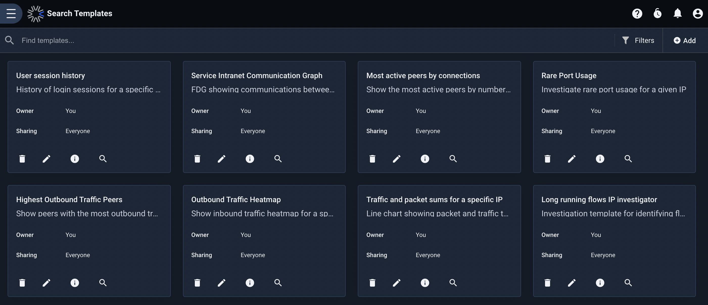
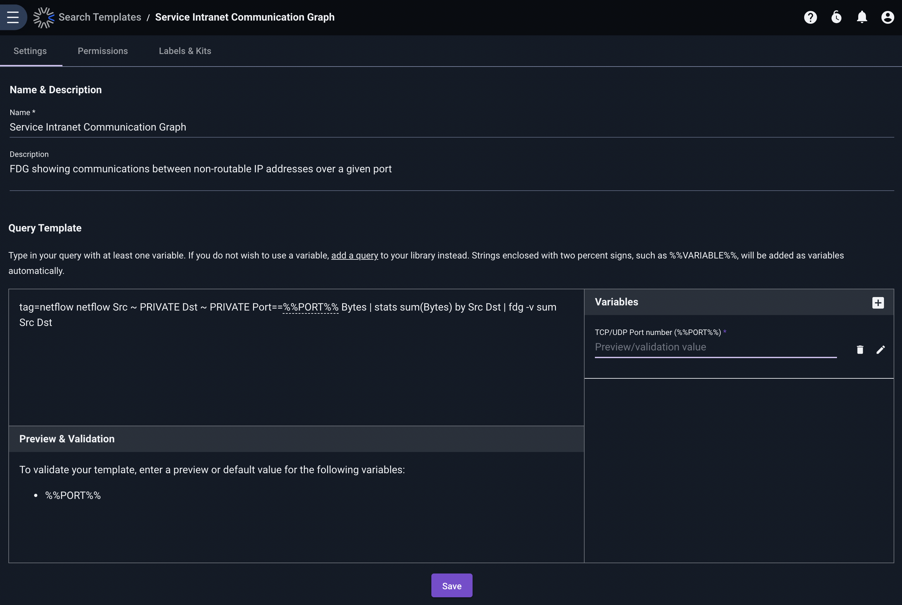
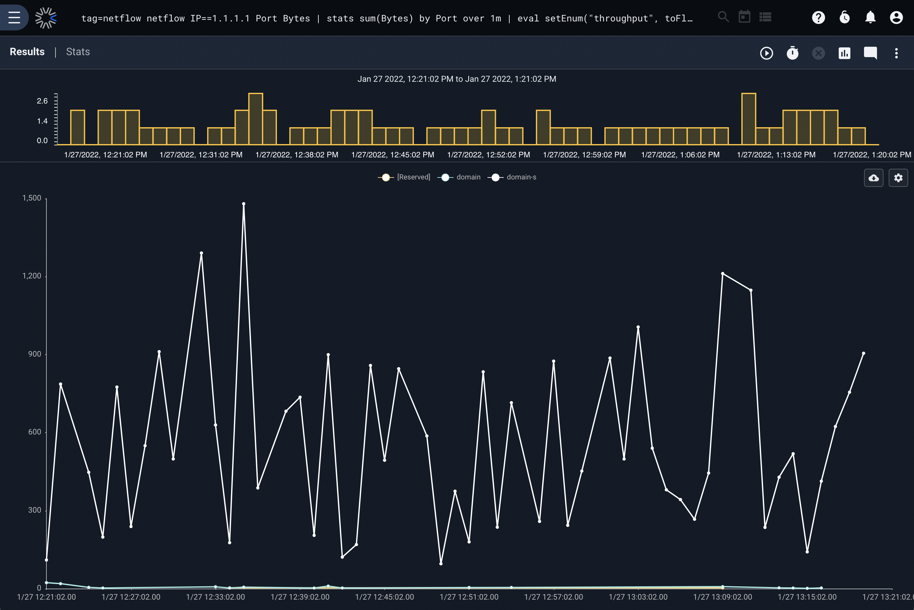
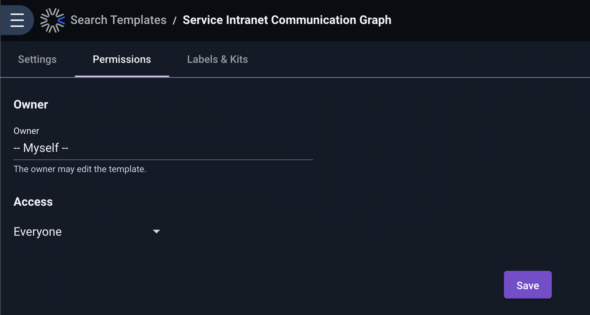

# Templates

Templates are special objects which define a DatalaiQ query containing *variables*. Multiple templates using the same variable(s) can be included in a dashboard to create a powerful tool called an **Investigative Dashboard**--for instance, templates which expect an IP address as their variable can be used to create an IP address investigation dashboard.

## The Template Page

The template management page may be accessed from the main menu, under the "Tools & Resources" section:

## Creating a Template

To create a new template, click the 'Add' button in the upper right corner of the templates page. DatalaiQ will prompt for several values which are used to define the template. In the image below, we're defining a template which will search netflow entries.

The various fields are described below:

* **Query Template**: In this field, we have entered a query containing a variable: `... %%PORT%% ... `.
* **Variable name in query**: Here, we define the name of the variable we used in the query. Note that you *can* use any string as the variable name (as long as it doesn't contain spaces), but we strongly recommend using something unique, like `%%VAR%%` or `__IPADDR__`.
* **Variable label**: This label will be shown when the user is prompted to fill in the variable. It should be short, but descriptive.
* **Variable hint**: This is additional text which will be shown when prompting for the variable; here we give examples of two strings the user may chose to enter.
* **'Require a value' checkbox**: This checkbox indicates whether or not a value *must* be entered. Some queries may be useful with or without a value in the variable, so this box enables that behavior.
* **Preview & Validation**: This is an *optional* text box where you can enter a value to check the resulting query. 

The remaining fields (Name, Description, etc.) are common to most objects in DatalaiQ and need no explanation.

When the template has been properly defined, we click 'Save' and are returned to the main template page.

## Executing a Template

You can run a template query by clicking the search icon on the template's card:

This will bring up a dialog prompting for the variable value:

Clicking "Launch" begins the search. We can see the template query at the top of the page, with the variable (`%%PORT%%`) replaced by the string we gave:

## Editing & Deleting Templates

To modify a template, click the edit icon (a pencil) on the template's tile. To delete the template, click the delete (trash can) icon.

## Sharing Templates

As with most objects in DatalaiQ, templates may be set visible to the owner only, shared with one or more groups, or shared globally (by administrators only). This is managed from the Permissions tab in the template editor:

## Using Templates in Dashboards

Templates may be embedded in dashboard tiles, creating what we call an *investigative dashboard*. When the dashboard is loaded, the user will be prompted for variable values. See the [dashboard documentation page](#!gui/dashboards/dashboards.md) for instructions on adding templates to dashboards.

These investigative dashboards can be accessed directly from query results using [actionables](/gui/actionables/actionables.md), which look for particular patterns of text and provide pop-up menus which can, among other things, launch an investigative dashboard. The selected text will be automatically used to replace the template variable.