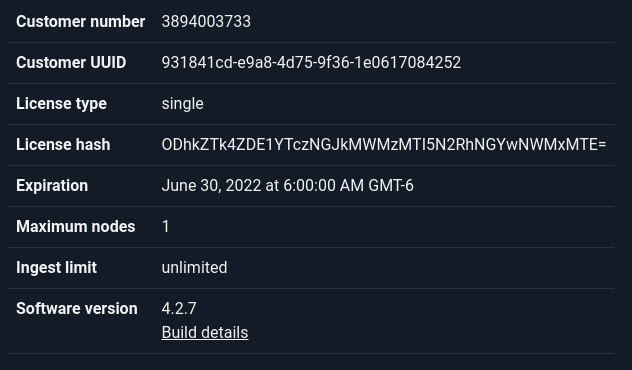

# ライセンス更新

DatalaiQのライセンスは有効期限が制限されています。ライセンス期限が近づいてくるとGUI上に通知が行われます。ライセンス更新を行う場合は、DAtalaiQサポートに連絡し（support@ppln.co）、再契約が必要になります。

新しいライセンスファイルを取得後、メニューの管理者セクションから「ライセンス」を選択し、新しいライセンスをアップロードして適用します:

また、ウェブサーバーノードに直接ライセンスファイルをアップロードし、`/opt/gravwell/etc/license`として配置することによってもライセンスを適用することができます。ライセンスファイルを配置したらサービスのコアプロセス（webserver、indexer、searchagent）の再起動が必要です。
