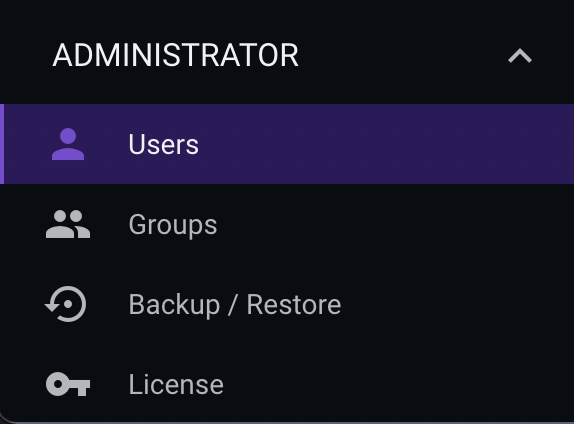
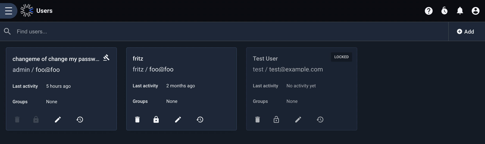
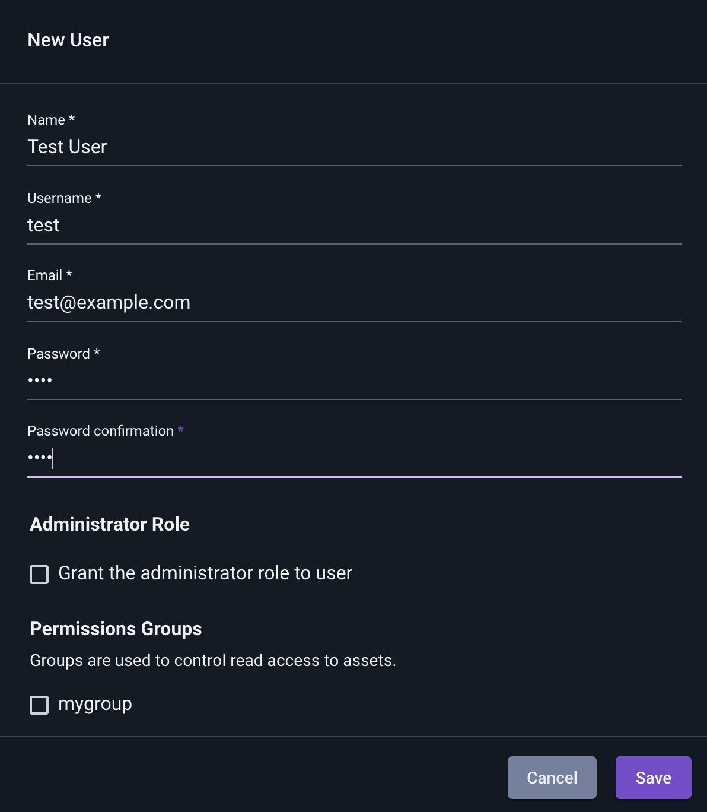
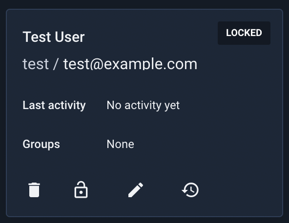
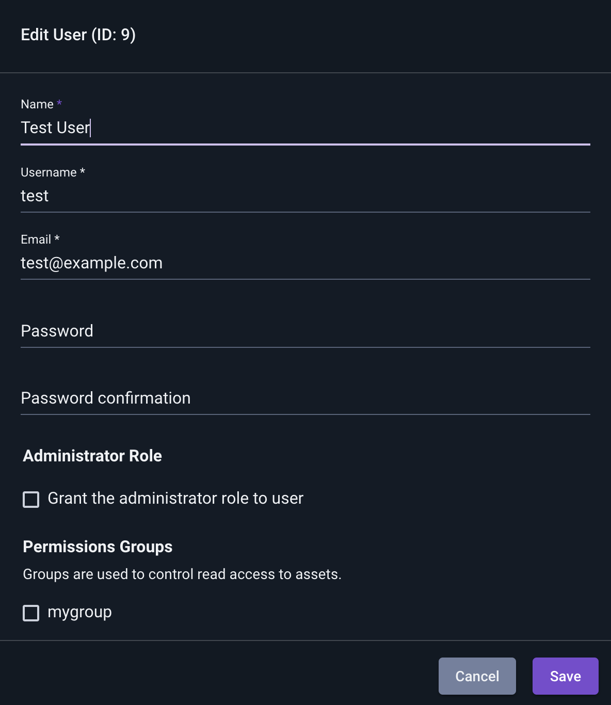
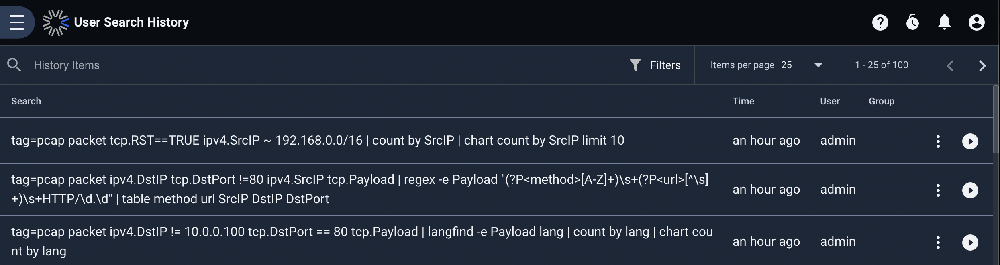
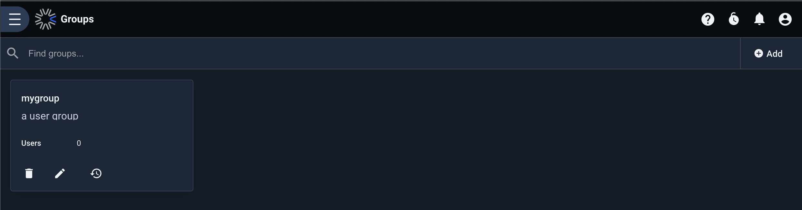
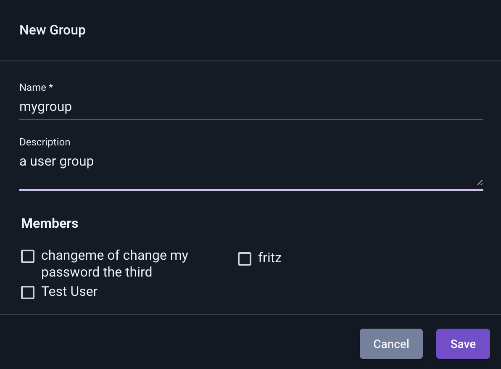
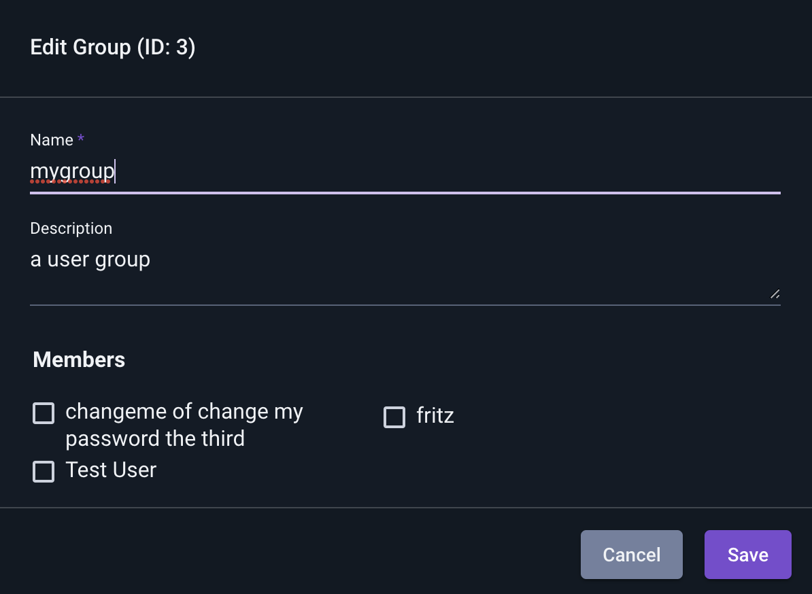

# ユーザー/グループ管理

DatalaiQシステムにはUnixで実装されているユーザー/グループによく似たユーザー/グループのシステムが実装されています。それぞれのユーザーには一意のユーザーID（UID）、それぞれのグループには一意のグループID（GID）が割り当てられます。それぞれのユーザーは0または1つ以上のグループに属します。

DatalaiQ上の Resources やダッシュボード、検索（クエリ）結果などはユーザーに所有され、時にはグループに共有されます。例えば、UIDが3であるユーザーによって所有され、いくつかのグループに共有されたとしてもグループのメンバーは Resources を読み取ることはできても編集することはできません。管理者ユーザーは読み取り、編集、削除のいずれも可能です。

ユーザー/グループの管理ページは、管理者セクションの下の方にメニューボタンがあります:

## ユーザー管理

新しくインストールされたシステムでは、ユーザーページには管理者ユーザーのみ表示されています。

### ユーザー追加

"追加" ボタンをクリックすると、新しいユーザーを定義するためのフィールドを含むダイアログ ボックスが表示されます。

ダイアログボックス下方にある "グループ権限" セクションをチェックすると、ユーザー作成時にチェックしたグループにユーザーを所属させることができます。"管理者" ボックスをチェックすると、ユーザーに管理者権限を与えることができますが、管理者権限ではユーザーに全ての操作を許可するため注意が必要です。

### ユーザーアカウントのロック/アンロック

管理者はそれぞれのユーザーメニューのロックアイコンを選択することで、一時的にユーザーをロックすることができます。

ユーザーは「ロック済み」としてマークされ、上記のようにロック アイコンがアンロックアイコンに変わります。

ユーザーがロックされると、ユーザーは全てのセッションからログアウトされ、アンロックされるまでアカウントにログインすることができなくなります。

### ユーザー編集

それぞれのユーザーのペンシルアイコンをクリックすると、ユーザーのダイアログが表示され、それぞれのフィールドを編集することができます:

### ユーザーの検索（クエリ）履歴を確認する

時計アイコンをクリックすると、ユーザーの検索履歴を表示することができます:

この検索履歴から、必要であれば管理者はクエリを際実行することができます。これはユーザー依存の問題をデバッグするのに役立ちます。

### ユーザー削除

ゴミ箱アイコンをクリックするとそのユーザーを削除することができます。削除する前に、確認のダイアログが表示されます。一度削除すると復元はできないため、削除ではなく一時的にロックすることも必要に応じて検討する必要があります。アカウントをロックした場合には、アカウントに紐づくそれぞれのデータは保持されます。

## グループ管理

"グループ" ページをクリックすると、システム上にある既存のグループが表示されます。デフォルトではDatalaiQでは何もグループが定義されていません。この画像では1つのグループのみ表示されています:

### グループ追加

グループを追加するには "追加" ボタンを押してダイアログからフィールドを定義します:

グループ作成時に、既存のユーザーをグループに追加することもできます。

### グループ編集

ペンシルアイコンをクリックするとダイアログが表示され、グループを編集することができます。グループ名とグループの接s名を変更することができます。グループは内部的にGIDによってのみ識別されます。

### グループ削除

ゴミ箱アイコンをクリックすることでグループを削除することができます。削除前には確認のダイアログが表示されます。一度削除すると、使用されていたGIDは再利用できなくなります。