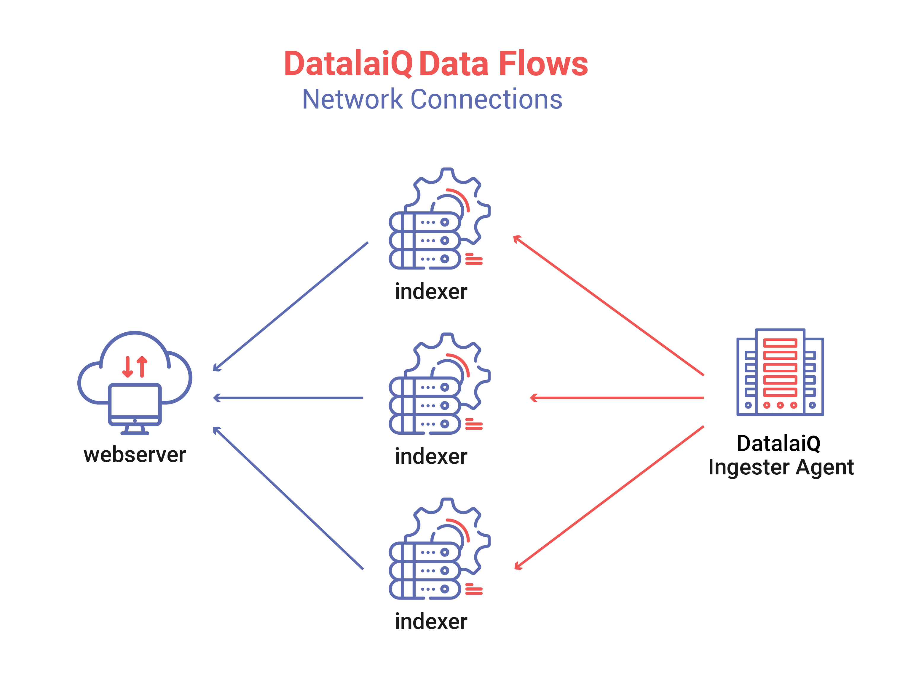
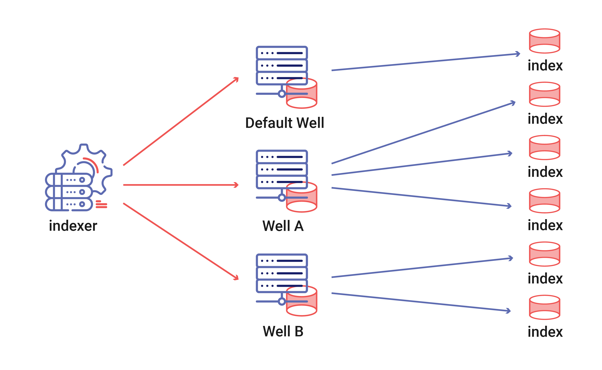

# DatalaiQシステムアーキテクチャ

DatalaiQシステム・アーキテクチャのセクションは、DatalaiQがアーキテクチャの観点からどのように展開され、運用されているかについての情報を提供するために設計されています。 すべてのインジェスターが単一のインデクサーに直接向けられている、シンプルな単一ノードのDatalaiQインスタンスを実行したい人は、このセクションを無視しても大丈夫です。 システム・アーキテクチャのセクションは、より大規模で複雑なインスタンスを展開するために、DatalaiQの基本的なトポロジーとアーキテクチャについてより深く理解する必要があるシステム管理者、DevOpsエンジニア、およびクラウド・アーキテクトのためのものです。

## クラスタトポロジ

DatalaiQは、データストリームから効果的に情報を抽出するために必要な認知的オーバーヘッドを削減し、高速に動作するように設計された高並列分散ストレージおよび検索システムです。 1日あたり数百テラバイトにも及ぶ大量のデータを効率的に保存、検索、管理するには、複数のマシンで大量のストレージデバイスを使用する必要があります。 1台のマシンに1台のディスクを搭載して、企業のスループット要件に対応することは、単純に不可能なのです。

DatalaiQの基本アーキテクチャは、インデクサ、インジェスタ、ウェブサーバを中心に設計されています。 どのコンポーネントも1対1の関係ではなく、（ウェブサーバーを除く）すべてのコンポーネントがロードバランス、フォールトトレラント、利用可能なハードウェアの最大限の活用を目的に設計されています。たとえば、小規模なISPのエッジルーターでZeekが動作し、フローをキャプチャしてDatalaiQに送信しているような場合です。

上記の基本インストールでは、3つのインデクサにエントリーを分散させる1つのインジェスタを使用しています。 問題のインジェスター（FileFollowerとします）は、マシン上の様々なデータソースを監視し、タイムスタンプを導き出し、DatalaiQクラスターに送信しています。 インジェスターは3つのインデクサーに負荷分散し、インデクサーのいずれか切れた場合は再接続します。 例えば、1つのインデキサーが（ハードウェア障害やシステムのアップグレードによって）停止した場合、他の2つのインデクサーが一時的に不足分を補い、インジェスターはオンラインに戻ると故障したインデクサーに再接続することになります。 インジェスターは消費キューです。つまり、あるインジェスターがより高速であれば、より多く消費することができ、より遅い、あるいは過負荷のインジェクターはより少なく消費することができます。

インジェストには様々な形やサイズがあり、インジェストAPIはオープンソースとなっています。 DatalaiQは、いくつかの基本的なインジェスターをオープンソース化しており、コミュニティの成長とともに、非常に多様なソースからデータを取得するためのインジェスターがどんどん登場しています; DatalaiQはバイナリ・インジェストと処理をサポートしているので、インジェストできるものに制限はありません。 DatalaiQはバイナリーの取り込みと処理をサポートしているので、取り込めるデータには制限がありません。データをアトミックなアイテムにカプセル化し、それにタイムスタンプを関連付けることができれば、DatalaiQはそれを消費して検索することができます。

非常に柔軟なインジェストフレームワークにより、非常に複雑で安全なトポロジーを実現することができます。 お客様はしばしば、データ分析プラットフォームを他のインフラからセグメント化することを希望します。 セグメント化とは、ネットワーク上のすべてのワークステーションがインデクサーと直接対話できるようにすることは望ましくないということです。  ここで、DatalaiQは任意の深さのインジェスター・フェデレーションをサポートします。つまり、ネットワークの分類が複数層ある場合、ホームDatalaiQインジェスターをデュアルにして、パブリックネットワークからプライベート分析ネットワークへ安全にデータをリレーすることができるのです。 例として、控えめなDatalaiQトポロジーが、より複雑な企業からデータを収集している場合を想定しています。 この企業には、公開用Webサーバー、プライベート・ファイル・サーバー、ドメイン・コントローラー、ファイアウォール、ワークステーション、およびプライベート・スイッチング装置があり、ネットワーク・エンジニアおよび I.T. セキュリティ担当者がそのすべてに責任を負っています。

よく考えられた安全な企業であるため、エンジニアとIT担当者はリソースをセグメント化し、ビジネスの領域を分離しています。 一般向けのウェブサーバーは、Windowsワークステーションとは別のネットワークセグメントにあります。 スイッチング機器はプライベートな管理LANを持ち、各セグメントにはステートフルファイアウォールがあり、誰もすり抜けることができないようになっています。 このトポロジーでは、すべてのデータソースがDatalaiQクラスタと直接通信できるわけではありません。 その代わりに、デュアルホームで厳重に保護されたインジェスター・リレーを導入し、公共のウェブサーバーのような信頼されていないネットワークから、DatalaiQ分析クラスターのようなより信頼できるネットワークにリレーしています。 Windowsドメイン・マシンはすべて、ログをドメイン・コントローラーにプッシュし、ドメイン・コントローラーはすべてをDatalaiQにプッシュします。 スイッチはポートアクティビティログとsflowレコードを、ファイアウォールはアラートを、ファイルサーバーはファイルアクセスログをプッシュしています。

この少し複雑な設定は、企業があらゆる形やサイズのログをDatalaiQにプッシュし、企業全体の可視性を大幅に向上させることができる方法を示しています。 乱立するログ・ソースを引き込むことで、スタッフは大量のデータに一箇所からアクセスして検索することができ、問題の診断と修正に必要な時間を短縮することができます。 IT オペレーションでは、コアスイッチからの sflow ログをファイアウォールログや Web サーバーアクセス記録と関連付けることで Web サーバーの問題をデバッグし、ユーザーがあるページにアクセスできない理由を特定することができます。 セキュリティ運用グループは、ドメインボックス間を移動するサムドライブを追跡したり、ポートのアクティビティとログインを関連付けて、未承認の機器を取り付けている従業員を特定したりすることができます。 DatalaiQはあらゆるタイプのデータソースを監視し、関連付けることができます。生のビデオをインデクサに送り込むことができるビデオ・インジェスタもあります。 DatalaiQはそれを可能にします。

## インデクサーのストレージトポロジ

DatalaiQは、ストレージを含むスタック全体を通して同時並行性というテーマを受け入れています。 インデクサは、単一のストレージアレイを持つ単一のストレージシステムではなく、ストレージオーケストレータなのです。 1台のインデクサには最大6万5千個のウェルがあり、それぞれのウェルには多数のストレージアレイを格納することができます。 DatalaiQのアーキテクトは、さまざまなデータソースのスループット要件を推定し、それに応じてストレージリソースを割り当てることができます。 各ストレージアレイは同時に動作し、検索パイプラインに供給し、インジェスターから非同期に消費します。 ストレージが非同期かつ分散型であることは、複数のストレージアレイにウェルをストライピングすることでスループットを向上させることができることを意味します。 例えば、DatalaiQインスタンスがsyslog、sflow、raw PCAPのインジェスターからデータを取得する場合、システム設計者は3つのウェルを割り当てることができます。 デフォルトのウェルは、syslogといくつかの基本的なWindowsログをキャプチャし、スループットが重要ではなく、データが長期的に保存される単一の大型回転ディスクアレイを指すかもしれません。 sflowウェルは、スループット要件はやや高いものの、保存要件は低いため、適度な大きさのSSDを1つ指定します。 しかし、PCAP専用のウェルは非常に高速でなければならず、回転ディスクや単一のSSDでは不十分です。 非常に高いスループットのインジェストと検索の要件は、複数のストレージアレイを活用するよう促すかもしれません。

DatalaiQのストレージアレイの並列性と構成性により、非常に高いスループットが実現します。 ハイエンドのNVMEドライブは、2GB/秒以上の読み取り速度を維持することができ、単一のウェルでこれらの数個にまたがってストライピングすると、DatalaiQは毎秒何GBも保存して読み取ることができることになります。 ハイエンドのストレージは、ボトルネックをストレージ速度からメモリ帯域幅にシフトするだけかもしれません。 クアッドチャネルメモリと2つのNVMEベースSSDストレージアレイを搭載したセミモダンハードウェアのテストインスタンスでは、ノードあたり3GB/秒を超える検索速度が確認されています。 AMD EpicまたはIntel E5 v4 CPUを搭載した中規模のクラスタでは、よく練られたクエリでノードあたり10GB/秒を容易に達成することができました。

## インジェスタートポロジ

DatalaiQのインジェストAPIは、高速かつシンプルに設計されています。 APIとDatalaiQのインジェストの多くはオープンソース化されており、ユーザーが他のツールでこれまで利用できなかったデータを追いかけてインジェストすることを奨励しています。 DatalaiQ のチームは、学術研究、民間セキュリティ・コンサルティング、高度なセキュリティの研究開発など、さまざまなバックグラウンドを持つメンバーで構成されています。 この幅広い多様性が、DatalaiQのインジェストと適用性に関するビジョンを形成し、チームは小規模なインスタンスを迅速に展開することを容易にする一方で、非常に大規模なマルチレベルのセキュリティ設備での使用を可能にするよう努めています。

コアとなるインジェストの仕組みは、バイト配列、タイムスタンプ、タグ（これはAPIによって提供されます）の3つのデータ項目のみを必要とします。 シンプルなインストールでは、数台のインジェストが直接インデクサーとやり取りしますが、より複雑なインジェストでは、データが信頼されていないエンクレーブからセキュリティの高いエンクレーブにシャッフルされるため、複数のレベルのフェデレーションを持つかもしれません。 可視性は、セキュリティ、分析、およびハント業務の鍵です。 データを分離したり、オペレータが手動でデータの関連付けを行わなければならないような複数のインストールを強制することは、受け入れられません。 DatalaiQは、インジェストリレーインジェスターによってフェデレーションを実現します。これは、インジェストAPIを両側で話し、デュアルホームのマシンがデータを集約してリレーすることを可能にします。

## 互換性

### リソースの最小要件

DatalaiQは[SystemD](https://en.wikipedia.org/wiki/Systemd)に対応したLinuxベースのOSで動作します。Linuxカーネルバージョン3.2以上、64bit X86アーキテクチャが必要です。

### バージョン固定

DatalaiQ 4.1.0 以降、DatalaiQ Indexer、Webserver、Search Agent、および Datastore の各コンポーネントはバージョンロックされるようになりました。つまり、これらのコンポーネント間では、すべてのコンポーネントが同じバージョンでなければならないようなAPIの変更が行われることがあります。このようなAPIの変更は、各バージョンのリリースノートに記載されています。 インジェスターはバージョンロックされていませんので、高い互換性を保つことができます。
