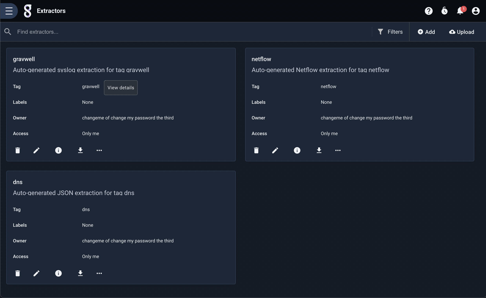
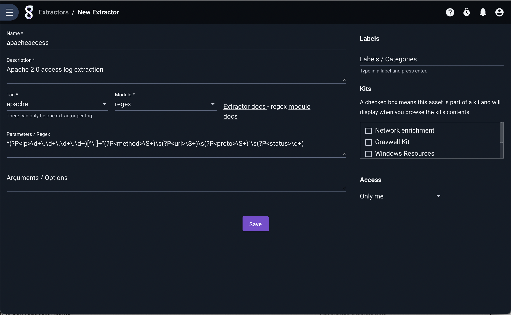
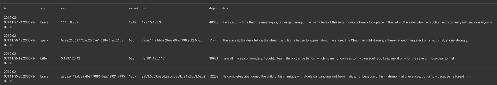
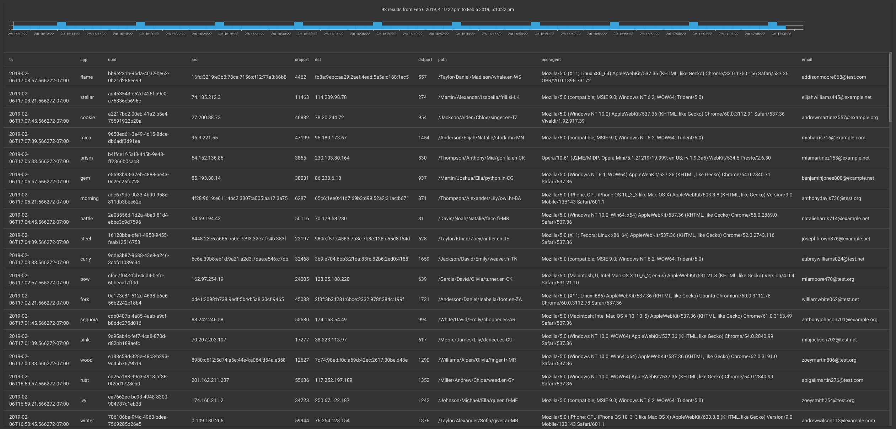
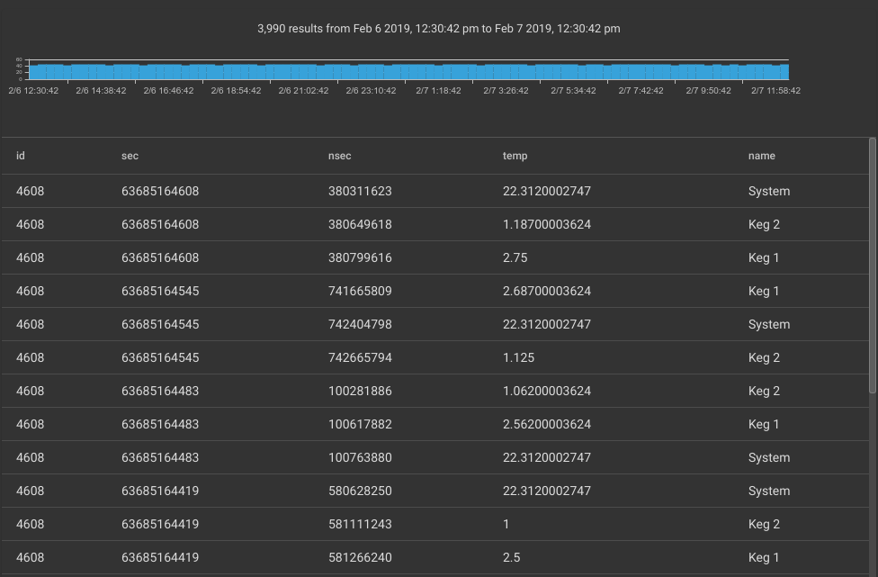
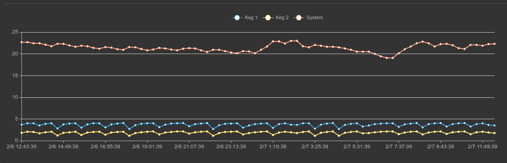
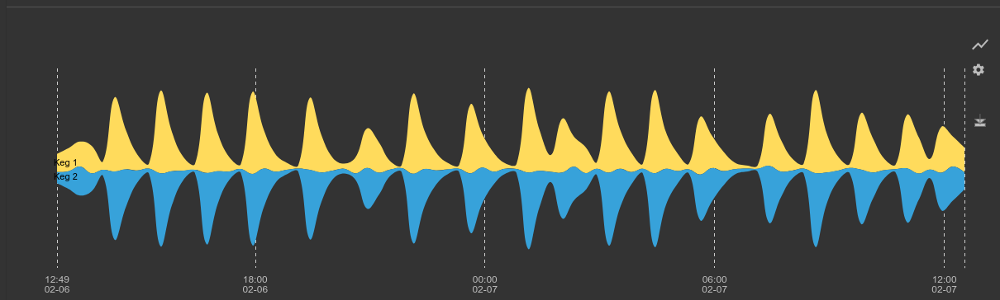

# DatalaiQ自動抽出

DatalaiQは、タグ単位の抽出定義を可能にし、非構造化データや自己記述できないデータ形式とのやりとりの複雑さを緩和します。 非構造化データは、目的のデータフィールドを抽出するために複雑な正規表現を必要とすることが多く、作成に時間がかかったり、エラーが発生しやすかったりすることがあります。

自動抽出機能は、タグに適用できる定義で、与えられたタグ内のデータからフィールドを正しく抽出する方法を記述したものです。そして、「ax」モジュールは、他のモジュールの適切な機能を自動的に呼び出します。

自動抽出定義は、タグに基づいて正しい抽出を透過的に参照する [AX](../search/ax/ax.md) モジュールによって使用されます。

## 自動抽出設定

Extractorsは、DatalaiQメインメニューの「Tools & Resources」サブメニューにある「Extractors」ページで管理されます。このページには、既存のExtractor定義がすべて表示されます:



右上の「追加」ボタンをクリックし、表示されるフォームに入力することで、新しい自動抽出器を定義することができます。:



以下のフィールドに入力する必要があります。:

* Name - 抽出物を表す、親しみやすい名前
* Description - 抽出を説明するためのユーザーフレンドリーな文字列です。
* Tag - 抽出に関連するタグ。ドロップダウンには既存のタグが表示されます。
* Module - 抽出に使用する処理モジュール（正規表現、スライス、csv、フィールドなど）。
* Parameters / Regex - 抽出定義
* Arguments / Options - 抽出モジュールの動作を変更するために使用するモジュール固有の引数(オプション)

抽出器は、作成後、そのタイルの鉛筆（編集）アイコンをクリックして編集することができます。

備考: 1ユーザーにつき1つのタグにつき、1つのみ抽出を定義することができます。

備考: 自動抽出は、常にエントリの完全な基礎データに対して行われます。 これらは、列挙された値の抽出には使用できません (「-e」引数は使用不可)。

### 自動抽出ファイル定義

自動抽出ツールは、テキストファイルで定義し、Extractors 管理ページの右上にある「Upload」ボタンをクリックして DatalaiQ にアップロードすることも可能です。各ファイルには複数のExtractor定義が含まれ、ファイルを再アップロードすると既存のExtractorも更新されるため、自動抽出の定義の共有や大量更新に便利な方法です。自動抽出ファイルは、[TOML V4](https://github.com/toml-lang/toml) フォーマットに従い、"#" 文字を使ったコメントを許可しています。

注意: DatalaiQの古いバージョンでは、自動抽出ファイルを `/opt/gravwell/extractions` で管理していました。これはもうサポートされませんが、そのディレクトリにある既存のファイルは、DatalaiQが更新されたときに自動的にインポートされます。*エキストラクターの管理*は、すべてDatalaiQ UIを通じて行われる必要があります。

各抽出器は、ヘッダと以下のパラメータを含みます:

* tag - 抽出に関連するタグ
* name - 抽出のための人間可読名
* desc - 抽出内容を表す、人間可読文字列
* module - 抽出に使用する処理モジュール（正規表現、スライス、csv、フィールドなど）。
* args - 抽出モジュールの動作を変更するために使用されるモジュール固有の引数
* params - 抽出定義

以下は、regexモジュールを使用してApache 2.0のアクセスログから基本的なデータを取得するために設計された自動抽出ファイルのサンプルです。:

```
#apacheのアクセスログからip, method, url, proto, statusを抽出するシンプルな方法です。
[[extraction]]
	tag="apache"
	name="apacheaccess"
	desc="Apache 2.0 access log extraction to pull requester items"
	module="regex"
	args="" #empty values can be completely omitted, the regex processor does not support args
	params='^(?P<ip>\d+\.\d+\.\d+\.\d+)[^\"]+\"(?P<method>\S+)\s(?P<url>\S+)\s(?P<proto>\S+)\"\s(?P<status>\d+)'
```

抽出パラメータの定義方法について、いくつかの重要な注意点があります。

1. 各抽出パラメータの値は、文字列として定義し、二重引用符または一重引用符で囲む必要があります。
2. 二重引用符で囲まれた文字列は、文字列エスケープのルールが適用されます（正規表現を使用する場合は注意が必要です）。
  a.  "\b" would be the backspace command (character 0x08) not the literal "\b".
3. 一重引用符で囲まれた文字列は生であり、文字列エスケープ規則の適用を受けません。
  a. '\b' is literally the backslash character followed by the 'b' character, not a backspace.

文字列のエスケープ規則を無視する機能は、バックスラッシュを多用する「正規表現」処理に特に便利です。

新しい"[[extraction]]"ヘッダーと新しい指定を確立するだけで、1つのファイルに複数の抽出を指定することができます。 以下は、1つのファイルに2つの抽出を指定する例です。:

```
#apacheのアクセスログからip, method, url, proto, statusを抽出するシンプルな方法です。
[[extraction]]
	tag="apache"
	name="apacheaccess"
	desc="Apache 2.0 access log extraction to pull requester items"
	module="regex"
	args="" #empty values can be completely omitted, the regex processor does not support args
	params='^(?P<ip>\d+\.\d+\.\d+\.\d+)[^\"]+\"(?P<method>\S+)\s(?P<url>\S+)\s(?P<proto>\S+)\"\s(?P<status>\d+)'

#CSVデータに名称を適用する抽出
[[extraction]]
	tag="locs"
	name="locationrecords"
	desc="AX extraction for CSV location data"
	module="csv"
	params="date, name, country, city, hash, a comma ,\"field with comma,\""
```

2つ目の「locs」タグの抽出では、必須ではないパラメータを省略し（ここではargsを指定しない）、バックスラッシュを使用して文字列のダブルクォートを許可していることを示します。 抽出に必要なパラメータは3つだけです。:

* module
* params
* tag

## フィルタリング

AXモジュールは、検索時のフィルタリングをサポートしています。 ただし、自動抽出 *定義* にはフィルタリングを適用できない。

#### フィルタリング識別子

| Operator | Name | Description |
|----------|------|-------------|
| == | Equal | フィールドが等しいこと
| != | Not equal | フィールドが同じであってはならない
| ~  | Subset | フィールドには値が含まれる
| !~ | Not Subset | フィールドに値が含まれていない

#### フィルタリング例

```
ax foo=="bar" baz~"stuff"
ax foo != bar baz !~ "stuff and things"
```

## 処理例

自動抽出の定義をいくつか紹介し、自動抽出を使用した場合と使用しない場合で同じタスクを達成するクエリを比較検討します。 また、AX 内でフィルタを使用する方法についても説明します。

### CSV

CSV（Comma Separated Values）は、比較的効率的にテキストを転送・保存できるシステムです。 しかし、CSVデータは自己記述できないため、CSVデータの束だけでは、実際にどのようなカラムがあるのかが分かりにくい場合があります。 自動抽出ツールを使って列名をあらかじめ定義しておけば、CSVデータの扱いが劇的に楽になります。

以下は、CSVでエンコードされたデータ入力の例です:

```
2019-02-07T10:52:49.741926-07:00,fuschia,275,68d04d32-6ea1-453f-886b-fe87d3d0e0fe,174.74.125.81,58579,191.17.155.8,1406,"これは間違いなく楽観的な事業です。しかし、私たちが現在の不完全さを論じるときに必ず聞こえてくるお喋りからしばらく解放され、現実的な困難や方法と手段のもつれから解放されるのは良いことです。しばらくの間、線路に立ち寄って、リュックサックを脇に置き、眉を拭きながら、登っていると思っている山の斜面の上について少し話すのもいいものだ。", "TL",Bury,396632323a643862633a653733343a643166383a643762333a373032353a653839633a62333361
```

たくさんのデータが入っていて、どのフィールドが何であるかがわからない。 さらに悪いことに、CSVデータにはカンマや周囲のスペースが含まれることがあり、肉眼でカラムを識別することは非常に困難です。 自動抽出ツールを使えば、カラム名と型を一度だけ特定し、「ax」モジュールを使って透過的にそれを活用することができるのです。

各要素を手動で抽出して名前を付けるとしたら、以下のようなクエリーになります:

```
tag=csvdata csv [0] as ts [1] as name [2] as id [3] as guid [4] as src [5] as srcport [6] as dst [7] as dstport [8] as data [9] as country [10] as city [11] as hash | table
```

以下は自動抽出設定宣言例です:

```
[[extraction]]
	name="testcsv"
	desc="CSV auto-extraction for the super ugly CSV data"
	module="csv"
	tag="csvdata"
	params="ts, name, id, guid, src, srcport, dst, dstport, data, country, city, hash"
```

その同じクエリが、次のようになります:

```
tag=csvdata ax | table
```

もし、特定のフィールドを抽出することに興味がなければ、単に名前を空白にすることができます。例えば、上記の例でGUIDを抽出する必要がない場合、paramsフィールドを `params="ts, name, id,, src, srcport, dst, dstport, data, country, city, hash"` と変更すればよいでしょう。

備考: CSV 自動抽出プロセッサは、以下の引数をサポートしていません。

備考: 変数 `params` の名前の位置は、フィールド名を示している。CSVのヘッダーとして扱います

### Fields

fields モジュールは非常に柔軟な処理モジュールで、データを抽出するために任意の区切り文字やフィールドルールを定義することができます。 Bro/Zeekのような人気のあるセキュリティ・アプリケーションの多くは、データのエクスポートにTSV（タブ区切り値）をデフォルトで使用します。 その他のカスタムアプリケーションでは、"|"のような奇妙な区切り文字や、"//"のような一連のバイトを使用することがあります。 fields extractor を使用すると、これらすべてを処理することができ、自動抽出ツールと組み合わせると、ユーザーはデータ形式の詳細を気にする必要がなくなります。

他の自動抽出プロセッサとは異なり、fieldsモジュールには様々な設定引数があります。 引数のリストは [fieldsモジュールドキュメント](/#!search/fields/fields.md) で完全に文書化されています。 "-e"フラグのみ未サポートです。

まずはタブ区切りのデータから見てみましょう:

```
2019-02-07T11:27:14.308769-07:00	green	21.41.53.11	1212	57.27.200.146	40348	Have I come to Utopia to hear this sort of thing?
```

fields モジュールを使って各データ項目を抽出すると、次のようなクエリーになります:

```
tag=tabfields fields -d "\t" [0] as ts [1] as app [2] as src [3] as srcport [4] as dst [5] as dstport [6] as data | table
```

同じことを実現するための自動抽出のコンフィギュレーションは以下です:

```
[[extraction]]
	tag="tagfields"
	name="tabfields"
	desc="Tab delimited fields"
	module="fields"
	args='-d "\t"'
	params="ts, app, src, srcport, dst, dstport, data"
```

axモジュールと上記の設定を使用すると、クエリは次のようになります:

```
tag=tagfields ax | table
```

ちょっと変な区切り文字"|"を使ったデータを見てみましょう:

```
2019-02-07T11:57:24.230578-07:00|brave|164.5.0.239|1212|179.15.183.3|40348|"In C the OR operator is ||."
```

最後のフィールドにはデリミターが含まれていることに注意してください。このデータを生成したシステムは、データ項目にデリミタを含める必要があることを知っていたので、そのデータ項目を二重引用符で囲んだのである。 fieldsモジュールは引用符で囲まれたデータを扱う方法を知っている。"-q "フラグを指定すると、モジュールは引用符で囲まれたフィールドを尊重するようになる。 引用符は、"-clean "フラグが指定されない限り、抽出されたデータ上に保持される。

fields モジュールを使用すると、次のようなクエリーになります:

```
tag=barfields fields -d "|" -q -clean [0] as ts [1] as app [2] as src [3] as srcport [4] as dst [5] as dstport [6] as data 
```

しかし、適切な自動抽出の設定（以下に示す）を行えば、クエリは極めて単純な `tag=barfields ax | table` とすることも可能です。:

```
[[extraction]]
	tag="barfields"
	name="barfields"
	desc="bar | delimited fields with quotes and cleaning"
	module="fields"
	args='-d "|" -q -clean'
	params="ts, app, src, srcport, dst, dstport, data"
```

見積書を削除してきちんとクリーニングした結果:



### Regex

自動抽出ツールで最もよく使われるのは正規表現かもしれません。 正規表現を正しく理解するのは難しく、誤入力しやすく、最適化するのも困難です。 もし正規表現の専門家がいれば、効率的で柔軟な抽出を行う高速な正規表現を作成し、それを自動抽出に組み込むだけで、そのことを忘れることができます。

以下は、率直に言ってめちゃくちゃなエントリーセットの例です（カスタムアプリケーションのログでは珍しくありません）。:

```
2019-02-06T16:57:52.826388-07:00 [fir] <6f21dc22-9fd6-41ee-ae72-a4a6ea8df767> 783b:926c:f019:5de1:b4e0:9b1a:c777:7bea 4462 c34c:2e88:e508:55bf:553b:daa8:59b9:2715 557 /White/Alexander/Abigail/leg.en-BZ Mozilla/5.0 (Linux; Android 8.0.0; Pixel XL Build/OPR6.170623.012) AppleWebKit/537.36 (KHTML, like Gecko) Chrome/60.0.3112.107 Mobile Safari/537.36 {natalieanderson001@test.org}
```

このデータは、あるカスタムアプリケーションの非常に醜いアクセスログです。私たちは、以下のようなフィールドを取得しようとしています。:

* ts - 各エントリーの冒頭のタイムスタンプ
* app - ハンドリングアプリケーションを表す文字列
* uuid - 一意な識別子
* src - ソースアドレス、IPv4とIPv6の両方
* srcport - ソースポート
* dst - 宛先アドレス、IPv4とIPv6の両方
* dstport - 宛先ポート
* path - URLのようなパス
* useragent - ユーザーエージェント
* email - リクエストに関連する電子メールアドレス

以下は、抽出器の定義の例です:

```
[[extraction]]
	module="regex"
	tag="test"
	params='(?P<ts>\S+)\s\[(?P<app>\S+)\]\s<(?P<uuid>\S+)>\s(?P<src>\S+)\s(?P<srcport>\d+)\s(?P<dst>\S+)\s(?P<dstport>\d+)\s(?P<path>\S+)\s(?P<useragent>.+)\s\{(?P<email>\S+)\}$'
```

例えば、すべてのデータを抽出してテーブルに格納するとします。

正規表現を使用する場合、このクエリは次のようになります:

```
tag=test regex "(?P<ts>\S+)\s\[(?P<app>\S+)\]\s<(?P<uuid>\S+)>\s(?P<src>\S+)\s(?P<srcport>\d+)\s(?P<dst>\S+)\s(?P<dstport>\d+)\s(?P<path>\S+)\s(?P<useragent>.+)\s\{(?P<email>\S+)\}$" | table
```

しかし、自動抽出装置とaxモジュールを使えば:

```
tag=test ax | table
```

結果は同じです:



ax モジュールを使ってフィールドにフィルタをかけたい場合、ax モジュールの名前付きフィールドに filter ディレクティブをアタッチするだけです。 この例では、抽出したすべてのフィールドを含むテーブルをレンダリングしながら、メールアドレスに「test.org」を含むすべてのエントリーを表示したいとします。

```
tag=test ax email~"test.org" | table
```

特定のフィールドだけが欲しい場合は、デフォルトですべてのフィールドを抽出するのではなく、その特定のフィールドだけを抽出するようにaxモジュールに指示します。

```
tag=test ax email~"test.org" app path | table
```

### Slice

[Slice](/search/slice/slice.md) モジュールは、バイナリ・データ・ストリームから直接データを抽出することができる強力なバイナリ・スライシング・システムです。 DatalaiQのエンジニアは、スライス・モジュール以外を使用しないプロトコル・ディスセクタ全体を開発しました。 しかし、バイナリデータの流れを切断してデータを解釈することは、気の弱い人にはできません。また、独自のデータストリームをスライスして切り取る美しいクエリーを構築しても、誰もそれを覚えようとはしませんし、コピー＆ペーストすることさえできません。

バイナリデータをテキストで表示するのは難しいので、このドキュメントでは16進エンコーディングでデータを表示します。 ここでは、醸造システムの正確な温度制御を維持するために冷媒コンプレッサーを制御する小さな制御システムから送られてくるバイナリデータストリームを切り取ります。 この制御システムは文字列、整数、そしていくつかの浮動小数点値を送信しますが、制御システムでよくあるように、すべてのデータは [Big Endian](https://en.wikipedia.org/wiki/Endianness) 順になっています。

備考: スライスAXプロセッサーが引数をサポートしていない（例："-e "は不可）。

#### Filtering

スライスAXプロセッサは、データを特定の型にキャストするように設計されています。 そのため、そのフィルタリングオプションは、他のモジュールよりも少し微妙です。 抽出された各値は、その型に基づいた特定のフィルタリング演算子のセットを持っています。 フィルタリング演算子と型の完全な説明については、[slice モジュールのドキュメント](../search/slice/slice.md) を参照してください。

#### Examples

まず、[hexlify](#!search/hexlify/hexlify.md)モジュールを使ってデータを16進数で見てみましょう。:

```
tag=keg hexlify
```

その結果、次のようなエントリーになります:

```
12000000000ed3ee7d4300000000014de536401800004b65672031
```

いくつかの調査を行った結果、パックドバイナリ構造には以下のものが含まれていることが確認できました:

| ID | Timestamp Seconds | Timestamp Nanoseconds | Temperature as 32bit float | ASCII name |
|----|-------------------|-----------------------|----------------------------|------------|
|bits 0:2 | bits 2:10              | bits 10:18                 | bits 18:22                      | bits 22:        |

これを利用して、以下のようなスライスクエリを生成し、各データ項目を抽出することができました:

```
tag=keg slice uint16be([0:2]) as id int64be([2:10]) as sec uint64be([10:18]) as nsec float32be([18:22]) as temp [22:] as name | table
```



手動クエリから、次のような自動抽出の設定を生成することができます:

```
[[extraction]]
	tag="keg"
	name="kegdata"
	desc="binary temperature control extractions"
	module="slice"
	params="uint16be([0:2]) as id int64be([2:10]) as sec uint64be([10:18]) as nsec float32be([18:22]) as temp [22:] as name"
```

複雑なスライスクエリは次のようになります:

```
tag=keg ax | table
```

フィルタリングといくつかの数学モジュールを使って、さらに一歩進んで、各プローブの最高温度を示すクールなグラフを生成することができます。:

```
tag=keg ax id==0x1200 temp name | max temp by name | chart max by name
```



さらにフィルタリングを使って樽の温度だけを選択し、温度のばらつきを調べることで、制御システムがどの程度温度を一定に保っているかを確認することができるのです:

```
tag=keg ax id==0x1200 temp name~Keg | stddev temp by name | chart stddev by name
```



自動抽出ツールと基本的な数学を使ってバイナリデータを解析すると、コンプレッサーが周期的に作動し、時間と共に温度が振動していることがはっきりとわかります。 もし私たちが醸造所を経営していたら、醸造責任者を呼んで、温度の許容範囲を狭めるために制御システムのロジックを調整するよう提案するかもしれませんし、このデータを使って冷たい飲み物を注ぐのに最適な時間を割り出すかもしれませんね。