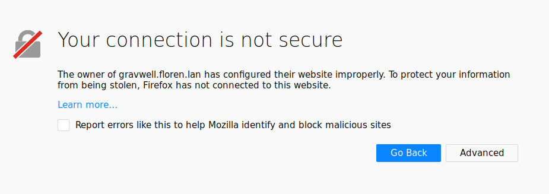
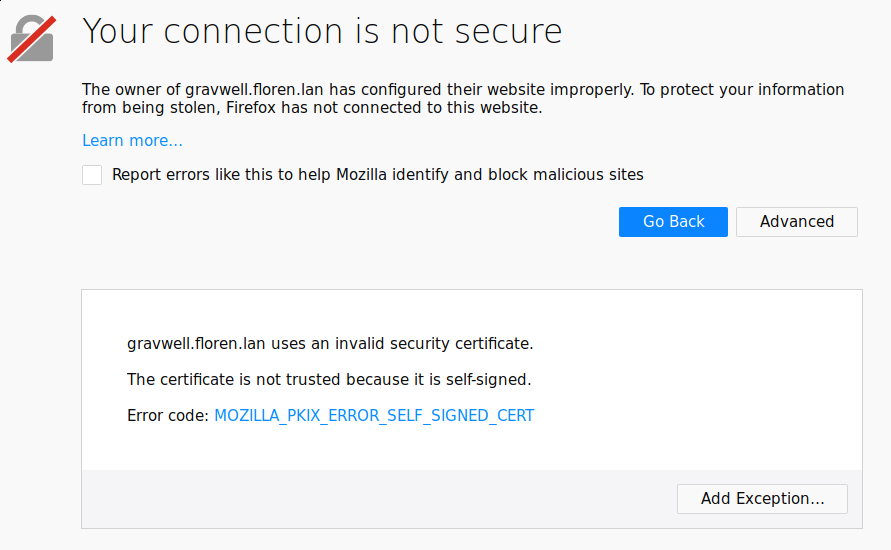
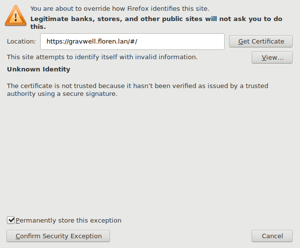
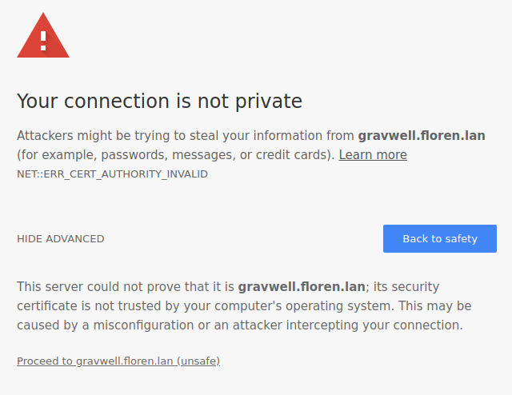
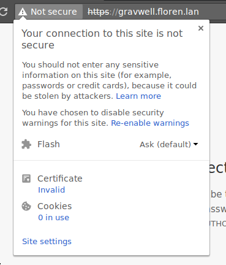
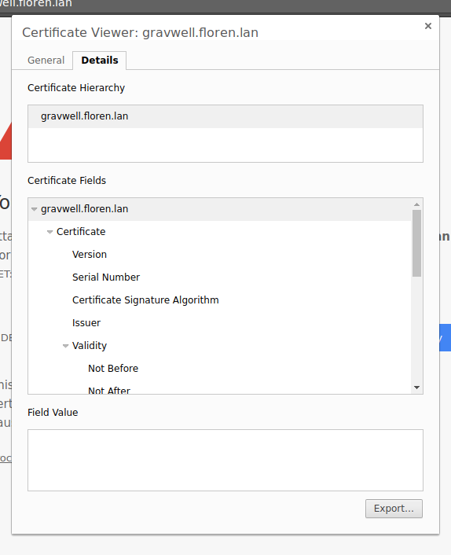
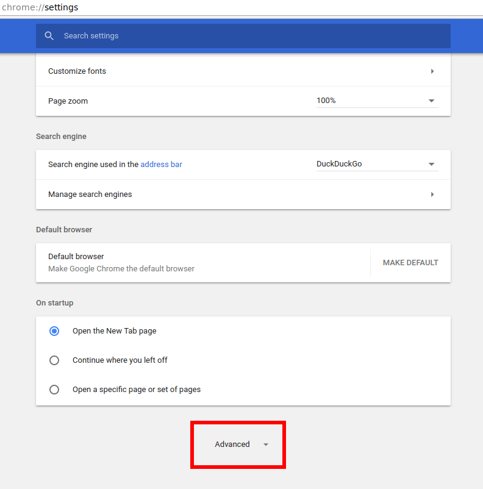
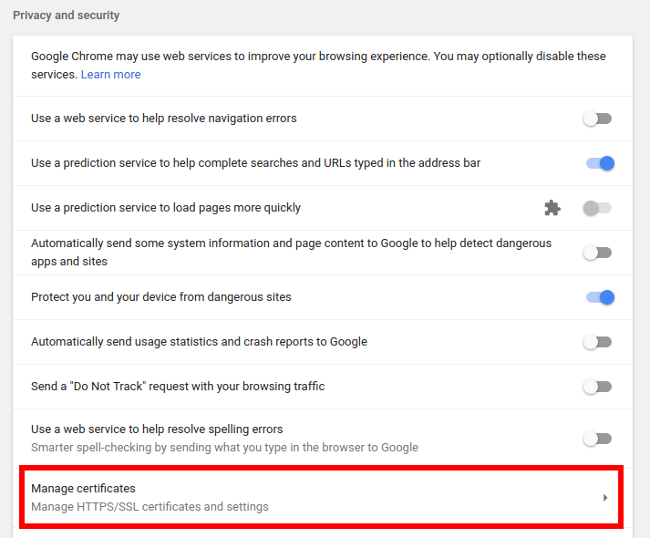
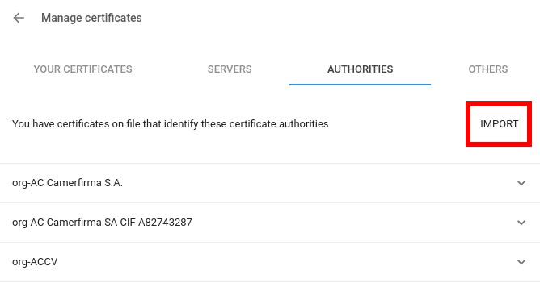
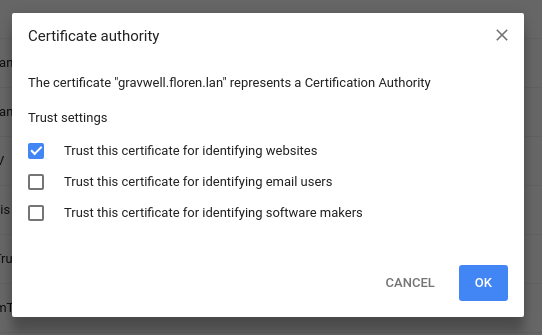

# TLS証明書の設定

DatalaiQはデフォルトでTLS証明書なしで出荷され、証明書を設定するまではすべての通信が暗号化されないことを意味します。これは、自動生成された自己署名証明書を使用すると、ブラウザの警告でユーザーを怖がらせ、誤ったセキュリティ感覚を与えてしまう傾向があるためです。自己署名証明書を適切に検証することは難しく、また、なりすましの可能性がある証明書を単純に受け入れるようユーザーを教育してしまう危険性があります。 さらに、Chromiumベースのブラウザの挙動は非常に気まぐれで、証明書の例外処理が予測できない方法でタイムアウトします（証明書を再認識するために、Chromium/Chrome zygoteプロセスを終了しなければならないことがよくあります）。

DatalaiQシステムをインターネットに公開する予定がある場合は、信頼できるプロバイダーから完全に検証された証明書を取得することを強くお勧めします。 LetsEncrypt](https://letsencrypt.org) の人々は、適切な証明書の検証について学ぶための素晴らしいリソースであり、彼らはすべての主要なブラウザで信頼されている無料の証明書を提供しています。

DatalaiQの管理者は、証明書について以下の3つのオプションがあります:

* 暗号化されていないHTTPのみを使用し続ける。これは、信頼できるプライベート・ネットワークからのみアクセスされる場合や、DatalaiQがnginxのようなHTTPプロキシによってフロント処理される場合に適しています。
* 適切に署名されたTLS証明書をインストールします。これは理想的な構成ですが、通常、DatalaiQインスタンスが一般にアクセス可能なホスト名を持っている必要があります。
* 自己署名入り証明書をインストールする。これは、DatalaiQへのトラフィックを暗号化したいが、何らかの理由で適切に署名された証明書を取得できない場合に意味があります。

## 対応するTLS暗号方式

多くのTLS暗号は暗号学的に安全でないと考えられているため、DatalaiQは以下のTLS暗号のみをサポートしています:

- RSA-WITH-AES-256-CBC-SHA
- ECDHE-ECDSA-WITH-AES-256-CBC-SHA
- ECDHE-RSA-WITH-AES-256-CBC-SHA
- ECDHE-ECDSA-WITH-AES-256-GCM-SHA384
- AES-128-GCM-SHA256
- AES-256-GCM-SHA384
- CHACHA20-POLY1305-SHA256

## HTTPのみを使用する

これはDatalaiQのデフォルトの設定であり、これを使用するために変更する必要はありません。ホームネットワーク上でDatalaiQを実験的に使用する場合や、仕事用の実験的ネットワーク上で評価する場合に適しています。また、DatalaiQのウェブサーバーがnginxのようなロードバランサー／リバース・プロキシを通してアクセスされる場合にも、この設定が許容されます；これにより、プロキシがHTTPS暗号化／復号化を行い、DatalaiQシステムから負荷を取り除くことができます。

証明書がないと、インジェスターはインデクサーへのトラフィックを暗号化することができないことに注意してください。インジェスターのトラフィックを暗号化したいが、ウェブサーバーをHTTPのみのモードにしておきたい場合、他のセクションで説明したように証明書をインストールすることができますが、 gravwell.conf の `Certificate-File` 、 `Key-File` 、 `TLS-Ingest-Port` オプションだけはアンコメントしてください。これにより、インデクサーのTLSは有効になりますが、WebサーバーのTLSは有効になりません。

備考: 分散型ウェブサーバとデータストアをHTTPSを無効にして構成する場合、データストアとウェブサーバの両方について、gravwell.confで`Datastore-Insecure-Disable-TLS`フラグを設定する必要があります。

## 正しく署名されたTLS証明書をインストールする

正しく署名されたTLS証明書は、DatalaiQにアクセスするための最も安全な方法です。ブラウザは文句を言わずに自動的に証明書を受け入れるでしょう。

証明書の取得はこのドキュメントの範囲外です。従来のプロバイダーから証明書を購入するか、[LetsEncrypt](https://letsencrypt.org)を使用して無料の証明書を取得することを検討してください。

証明書を使用するために、DatalaiQは証明書と鍵のファイルがある場所を教えてもらう必要があります。ファイルは `/etc/certs/cert.pem` と `/etc/certs/key.pem` にあると仮定して、 gravwell.conf を編集して `Certificate-File` と `Key-File` オプションをアンコメントし入力する必要があります:

```
Certificate-File=/etc/certs/cert.pem
Key-File=/etc/certs/key.pem
```

備考: これらのファイルは、「gravwell」ユーザが読めるようにしなければなりません。しかし、鍵ファイルを他のユーザーから保護するように注意してください。もし、世界的に読めるようにすると、システム上のどのユーザーも秘密鍵にアクセスできるようになります。

ウェブサーバーでHTTPSを有効にするには、`Web-Port`ディレクティブを80から443に変更し、`Insecure-Disable-HTTPS`ディレクティブをコメントアウトしてください。

TLSで暗号化されたインジェスター接続を有効にするには、`TLS-Ingest-Port=4024`という行を見つけてコメントを解除してください。

検索エージェントでHTTPSを有効にするには、 /opt/gravwell/etc/searchagent.conf を開き、 `Insecure-Use-HTTP=true` 行をコメントアウトし、 `Webserver-Address` 行のポートを 80 から 443 に変更します。

最後に、ウェブサーバー、インデクサー、サーチエージェントを再起動します。:

```
systemctl restart gravwell_webserver.service
systemctl restart gravwell_indexer.service
systemctl restart gravwell_searchagent.service
```

備考: データストアと複数のウェブサーバを使用する場合、ウェブサーバが自己署名証明書を使用して相互に通信できるようにするには、`Search-Forwarding-Insecure-Skip-TLS-Verify パラメータ`を `true` に設定する必要があります。データストアで自己署名証明書を使用する場合は、ウェブサーバで `Datastore-Insecure-Skip-TLS-Verify` を設定して、データストアとの通信を可能にする必要があります。

## 自己署名証明書をインストールする

適切なTLS証明書ほど安全ではありませんが、自己署名証明書により、ユーザーとDatalaiQの間の暗号化された通信が保証されます。また、自己署名証明書を信頼するようにブラウザに指示することで、繰り返し表示される警告画面を回避することも可能です。

まず、DatalaiQのインストール時に配布されるプログラム `gencert` を使って `/opt/gravwell/etc` に1年間の証明書を生成してみます:

```
cd /opt/gravwell/etc
sudo -u gravwell ../bin/gencert -h HOSTNAME
```

HOSTNAME は、必ず DatalaiQ システムのホスト名または IP アドレスに置き換えてください。複数のホスト名またはIPを指定するには、カンマで区切ります。例えば、`gencert -h gravwell.floren.lan,10.0.0.1,192.168.0.3` と指定します。

次に gravwell.conf を開き、`Certificate-File` と `Key-File` ディレクティブのコメントを解除します。デフォルトでは、先ほど作成した2つのファイルが正しく指定されているはずです。

ウェブサーバーでHTTPSを有効にするには、`Web-Port`ディレクティブを80から443に変更し、`Insecure-Disable-HTTPS`ディレクティブをコメントアウトしてください。

TLSで暗号化されたインジェスター接続を有効にするには、`TLS-Ingest-Port=4024`という行を見つけてコメントを解除してください。

検索エージェントでHTTPSを有効にするには、 /opt/gravwell/etc/searchagent.conf を開き、 `Insecure-Use-HTTP=true` 行をコメントアウトし、 `Webserver-Address` 行のポートを 80 から 443 に変更します。

最後に、ウェブサーバー、インデクサー、サーチエージェントを再起動します。:

```
systemctl restart gravwell_webserver.service
systemctl restart gravwell_indexer.service
systemctl restart gravwell_searchagent.service
```

### 自己署名証明書をブラウザに信頼させる

ブラウザは、証明書が認識されたルートCAによって署名されていない場合、警告を発します。しかし、手動で証明書をインストールすることで、ブラウザに証明書を信用させることができます。

#### Firefox

Firefoxに証明書をインストールするのは簡単です。まず、HTTPS経由でDatalaiQインスタンスに移動します。Firefoxには、次のような画面が表示されます。:



「詳細設定」ボタンをクリックします。:



次に「例外の追加...」をクリックします。



デフォルトは適切であるべきですが、「この例外を恒久的に保存する」がチェックされていることを確認してください。セキュリティ例外の確認」をクリックします。

これでFirefoxは、証明書の有効期限が切れるまで、自己署名証明書を受け入れるはずです。

#### Chrome

Chromeブラウザでの証明書のインストールは少し複雑です。まず、HTTPS経由でDatalaiQインスタンスにナビゲートしてください。Chromeに警告画面が表示されます。:



アドレスバーの「安全ではありません」ラベルをクリックします:



次に、「証明書」の下にある「無効」リンクをクリックします。証明書ビューアーのウィンドウが開くので、「詳細」タブをクリックします:



Export」ボタンを選択します。Chromeが証明書を保存するためのファイルダイアログを表示するので、どこかに保存して場所を覚えておいてください。

ここで、アドレスバーに[chrome://settings](クローム://設定)と入力するか、Chromeブラウザーのメニューから[設定]を開いてください。一番下までスクロールして、[詳細設定]ボタンをクリックします。:



プライバシーとセキュリティ」セクションの中で、「証明書の管理」を見つけてクリックします。:



次に、「権限」タブを選択し、「IMPORT」をクリックします:



ファイルダイアログが開くので、先ほど保存した証明書ファイルを選択します。次のダイアログで、「Webサイトを識別するためにこの証明書を信頼する」にチェックを入れて、「OK」をクリックします:



これで、これ以上SSLの警告が出ることなく、DatalaiQタブを更新できるはずです。
