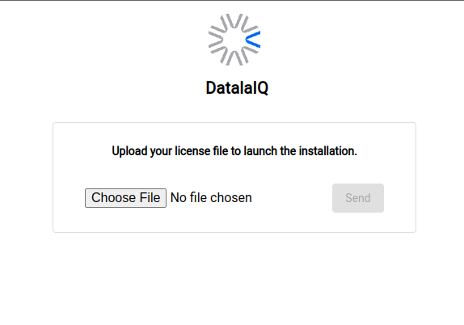
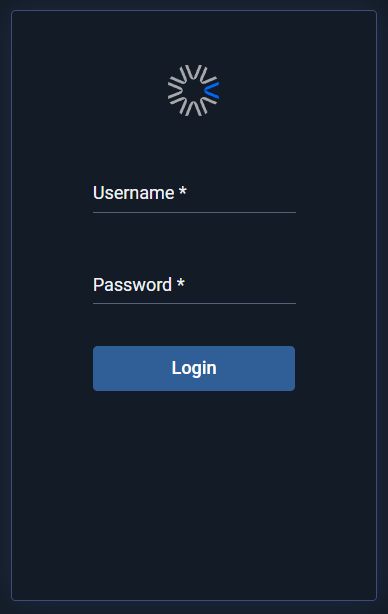
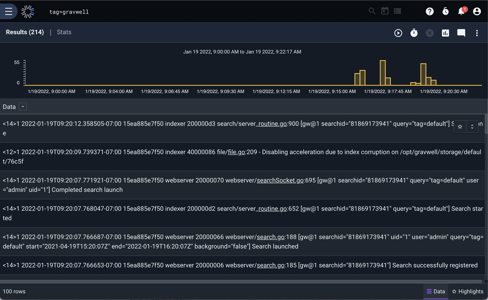
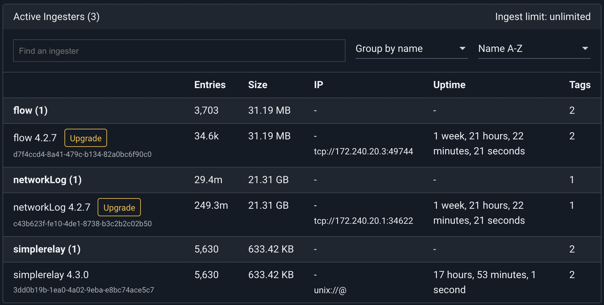

# DockerでDatalaiQをデプロイする

Docker Hubでビルド済みのDockerイメージが利用できるため、実験や長期的な使用のためにDatalaiQをDockerにデプロイすることは非常に簡単です。このドキュメントでは、Docker内でDatalaiQ環境をセットアップする方法を紹介します。

DatalaiQの有料カスタマーで、DatalaiQをDockerでデプロイしたい場合は、support@ppln.co までお問い合わせください。

[//]: # (We also have some information about deploying a custom Docker instance [on this wiki]&#40;#!configuration/custom-docker.md&#41; and [on our blog]&#40;https://www.gravwell.io/blog/gravwell-docker-deployment&#41;.)

DatalaiQをセットアップしたら、[クイックスタート](#!quickstart/quickstart.md)をチェックして、DatalaiQを使うためのいくつかの出発点を得てください。

備考: MacOS上でDockerを実行しているユーザーは、[こちら](https://docs.docker.com/docker-for-mac/networking/)で説明したように、MacOSホストがコンテナに直接IPアクセスできないことに注意する必要があります。ホストからコンテナのネットワークサービスにアクセスする必要がある場合は、追加のポートを転送する準備をしておいてください。

## Dockerネットワークを作成する

DatalaiQコンテナを他のコンテナから分離するために、`gravnet`と呼ばれるDockerネットワークを作成します:

	docker network create gravnet

## インデクサとウェブサーバをデプロイする

DatalaiQのインデクサとWebサーバのフロントエンド、そしてSimple Relayのインジェスタは、利便性を考慮して単一のDockerイメージ（[gravwell/gravwell](https://hub.docker.com/r/gravwell/gravwell/)）で提供されています。ウェブサーバーにアクセスするために、ホストのポート80をフォワードした状態で起動します:

	docker run --net gravnet -p 8080:80 -p 4023:4023 -p 4024:4024 -d -e GRAVWELL_INGEST_SECRET=MyIngestSecret -e GRAVWELL_INGEST_AUTH=MyIngestSecret -e GRAVWELL_CONTROL_AUTH=MyControlSecret -e GRAVWELL_SEARCHAGENT_AUTH=MySearchAgentAuth --name gravwell gravwell/gravwell:latest

新しいコンテナの名前は `gravwell` であることに注意してください。インジェスターをインデクサーに向けるときにこれを使用します。

私たちはいくつかの環境変数を設定しましたが、これは検討に値します。これらは、DatalaiQのコンポーネント間で通信するために使用される共有秘密を設定します。通常、これらは[設定ファイル](#!configuration/parameters.md)で設定しますが、よりダイナミックでDockerフレンドリーな設定のために、[環境変数](#!configuration/environment-variables.md)で設定することも可能です。GRAVWELL_INGEST_SECRET=MyIngestSecret` の値は、後でインジェストにも使用する予定です。設定する変数は:

* `GRAVWELL_INGEST_AUTH=MyIngestSecret` は、インジェストの認証に MyIngestSecret を使用するよう *indexer* に指示します。
* `GRAVWELL_INGEST_SECRET=MyIngestSecret` は、 *Simple Relay ingester* に MyIngestSecret を使用してインデクサを認証するよう指示します。これは GRAVWELL_INGEST_AUTH の値と一致しなければなりません!
* `GRAVWELL_CONTROL_AUTH=MyControlSecret` は、 *frontend* と *indexer* に、 MyControlSecret を使用して互いに認証するよう指示します。
* `GRAVWELL_SEARCHAGENT_AUTH=MySearchAgentAuth` は、検索エージェントを認証する際に MySearchAgentAuth を使用するよう *フロントエンド* に指示します。

注意: 長期的に運用する場合、特にインターネットに公開する場合は、これらの値を任意に設定することを強くお勧めします。

注意: The secret value for 
GRAVWELL_INGEST_AUTH must match GRAVWELL_INGEST_SECRET

### 永続的ストレージの設定

DatalaiQのデフォルトのDocker展開は、すべてのストレージにベースとなるコンテナを使用しますが、これはコンテナを削除するとすべてのデータが失われることを意味します。 Dockerは、バインドやボリュームなど、基盤となるコンテナから独立した永続的なストレージを設定するためのオプションをいくつか提供しています。 dataliqを本番環境にデプロイする場合、コンポーネントに応じていくつかのディレクトリを永続ストレージに維持したいと思うことでしょう。 永続的ストレージに関する追加情報については、[Docker ボリューム](https://docs.docker.com/storage/volumes/) のドキュメントを参照してください。

#### インデクサー永続的ストレージ

DatalaiQ インデクサは、保存されたデータ・シャードと `tags.dat` ファイルという 2 つの重要なデータ・セットを保持します。 インデクサーの他のほとんどすべてのコンポーネントは、データを失うことなく復元することができますが、通常の運用では、いくつかのディレクトリを永続的なストレージにバインドしておく必要があります。 重要なデータは `storage`、`resources`、`log`、`etc` ディレクトリに存在する。 各ディレクトリは個別のボリュームにマウントするか、`gravwell.conf`ファイルで単一の永続ストレージディレクトリを指すように設定することができます。 例えば、Docker 内の永続的なストレージを使用するために設計された `gravwell.conf` の例では、各データディレクトリのストレージパスを `/opt/gravwell/persistent` 内の代替パスを指すように変更することができます。 すべての `gravwell.conf` 設定パラメータに関する完全なドキュメントは [詳細設定](parameters.md) ページで見ることができます。

#### ウェブサーバー永続的ストレージ

DatalaiQ Webサーバーは、設定データや検索結果を失わないために維持すべきいくつかのディレクトリを保持しています。 etc`、`resources`、`saved`の各ディレクトリには、コンテナのデプロイメントに関わらず維持されるべき重要な情報が含まれています。 saved` ディレクトリには、ユーザーが保存することを選択した、保存された検索結果が格納されています。 etc` ディレクトリには、ユーザーデータベース、ウェブストア、および `tags.dat` ファイルが含まれます。これらのファイルはすべて、DatalaiQ を適切に動作させるために重要なものです。

#### インジェスター永続的ストレージ

DatalaiQインジェストはデータを中継するように設計されており、通常は永続的なストレージを必要としませんが、例外としてキャッシュシステムがあります。 DatalaiQのインジェストAPIにはキャッシュシステムが統合されており、インデクサへのアップリンクが失敗しても、インジェスターはローカルにデータを永続的なストアにキャッシュすることができるので、データが失われることはありません。 ほとんどのインジェストはデフォルトではキャッシュを展開しませんが、一般的なキャッシュの保存場所は `/opt/gravwell/cache` です。 cache`ディレクトリを永続的なストレージにバインドすることで、ingesterは状態を維持し、コンテナの再起動や更新があってもデータが失われないようにします。

## ライセンスのアップロードとログイン

DatalaiQが起動しているので、ウェブブラウザでホスト上のポートhttp://localhost:8080。ライセンスのアップロードが要求されるはずです:



備考: 有料ユーザーと既存のCommunity Editionユーザーは、電子メールでライセンスを受け取っているはずです。まだCommunity Editionにサインアップしていない方は、[https://www.gravwell.io/download](https://www.gravwell.io/download)にアクセスして、ライセンスを取得してください。

ライセンスをアップロードし、それが検証されると、ログインプロンプトが表示されます:



デフォルトの認証情報である **admin** / **changeme** でログインしてください。これでDatalaiQに入りました! DatalaiQをしばらく運用するのであれば、パスワードを変更した方が良いでしょう（右上のユーザーアイコンをクリックしてパスワードを変更します）。

## テスト用のデータを追加する

gravwell/gravwell Dockerイメージには、Simple Relay [ingester](#!ingesters/ingesters.md) がプリインストールされて出荷されています。これは以下のポートでリッスンします:

* TCP 7777（行区切りログ用）（タグは「default」）。
* syslogメッセージ用のTCP 601（タグは'syslog'）。
* syslogメッセージ用UDP 514（タグは'syslog'）。

DatalaiQにデータを取り込めるようにするには、netcatを使ってポート7777に行を書き込めばいいのです。しかし、VMを起動する際に、これらのポートをホストに転送していません。幸い、`docker inspect`を使えば、DatalaiQコンテナに割り当てられたIPアドレスを取得することができます:

	docker inspect -f '{{range .NetworkSettings.Networks}}{{.IPAddress}}{{end}}' gravwell

この場合、それは **172.19.0.2** でした。次に、netcatを使っていくつかの行を送信し、終了したらCtrl-Cを押すことができます:

	$ netcat 172.19.0.2 7777
	this is a test
	this is another test

注意: MacOSユーザーは、コンテナが実際にはLinux VM内で実行されるため、コンテナに直接IPでアクセスすることはできません。Dockerコンテナ（同じコンテナまたは新しいコンテナ）内からnetcatを使用するか、DatalaiQコンテナを起動する際にポート7777をホストに転送することができます。

そして、過去1時間の簡単な検索を行い、データが入力され、DatalaiQが正常に動作していることを確認することができます:



## インジェスターの設定

gravwell/gravwellイメージに同梱されているSimple Relayインジェスターの他に、インジェスター用のプレビルドイメージを多数提供しています。詳細は、[DatalaiQ Docker Hub](https://hub.docker.com/u/gravwell)のページで確認することができます。

ここではNetflowインジェスターを起動しますが、同じコマンド（名前とポートを変更）を他のインジェスターにも使用することができます:

	docker run -d --net gravnet -p 2055:2055/udp --name netflow -e GRAVWELL_CLEARTEXT_TARGETS=gravwell -e GRAVWELL_INGEST_SECRET=MyIngestSecret gravwell/netflow_capture

環境変数を設定するために `-e` フラグを使用することに注意してください。これにより、インジェストのために 'gravwell' という名前のコンテナに接続するよう指示し（GRAVWELL_CLEARTEXT_TARGETS=gravwell）、共有インジェストシークレットを 'IngestSecrets' に設定する（GRAVWELL_INGEST_SECRET=IngestSecrets）ことで動的にインジェストを構成することができるようになりました。

`-p 2055:2055/udp` オプションは、コンテナからホストへ UDP ポート 2055 (Netflow v5 ingest ポート) を転送します。これにより、Netflow レコードをインジェストコンテナに送信することが容易になるはずです。

備考: netflow ingesterは、デフォルトでポート6343上のUDP上でIPFIXレコードを受け入れるように設定されています。IPFIXレコードもインジェストしたい場合は、上記のコマンドラインに `-p 6343:6343/udp` を追加してください。

インジェスターが有効であることは、メニューのIngesters項目をクリックすることで確認できます:



これで、ホストのポート 2055 にレコードを送信するように Netflow ジェネレーターを設定することができます。

## カスタマイズサービス

DatalaiQの公式Dockerコンテナには、コンテナ内で複数のサービスを非常に簡単に起動・制御するためのサービス管理システムが含まれています。 マネージャは、サービスの再起動、エラー報告、バックオフの制御を行います。 DatalaiQは、[github](https://github.com/gravwell)上で[管理](https://github.com/gravwell/manager)アプリケーションをBSD 3-Clauseライセンスの下でオープンソースしています。 もしあなたが、Dockerコンテナのために、非常に小さく、簡単に設定できるsystemdのようなサービスマネージャを望んでいるなら、ぜひ使ってみてください。

公式のdataliq Dockerイメージには、Simple Relayインジェスターだけでなく、DatalaiQスタック（インデックスサーバーとウェブサーバー）のフルセットが含まれています。 デフォルトのマネージャ構成は:

```
[Global]
	Log-File=/opt/gravwell/log/manager.log
	Log-Level=INFO

[Error-Handler]
	Exec=/opt/gravwell/bin/crashReport

[Process "indexer"]
	Exec="/opt/gravwell/bin/gravwell_indexer -stderr indexer"
	Working-Dir=/opt/gravwell
	Max-Restarts=3 #three attempts before cooling down
	CoolDown-Period=60 #1 hour
	Restart-Period=10 #10 minutes

[Process "webserver"]
	Exec="/opt/gravwell/bin/gravwell_webserver -stderr webserver"
	Working-Dir=/opt/gravwell
	Max-Restarts=3 #three attempts before cooling down
	CoolDown-Period=30 #30 minutes
	Restart-Period=10 #10 minutes

[Process "searchagent"]
	Exec="/opt/gravwell/bin/gravwell_searchagent -stderr searchagent"
	Working-Dir=/opt/gravwell
	Max-Restarts=3 #three attempts before cooling down
	CoolDown-Period=10 #10 minutes
	Restart-Period=10 #10 minutes

[Process "simple_relay"]
	Exec="/opt/gravwell/bin/gravwell_simple_relay -stderr simple_relay"
	Working-Dir=/opt/gravwell
	Max-Restarts=3 #three attempts before cooling down
	CoolDown-Period=10 #10 minutes
	Restart-Period=10 #10 minutes
```

マネージャーアプリケーションのこのデフォルト設定は、バグの特定と修正に役立つエラーレポートシステムを有効にします。 サービスがゼロ以外の終了コードで終了した場合、エラーレポートが表示されます。 エラー報告システムを無効にするには、 "[Error-Handler]" セクションを削除するか、 環境変数 "DISABLE_ERROR_REPORTING" に "TRUE" を指定して渡します。

サービス名を全角で書き、先頭に "DISABLE_"を付けた環境変数に "TRUE "を代入することで、起動時に個々のサービスを無効化することができる。

たとえば、エラーレポートなしでdatalaiqドッカーコンテナを起動するには、「-e DISABLE_ERROR_REPORTING=true」オプションで起動する。

SimpleRelay インジェスターを無効にしたい場合は、"-e DISABLE_SIMPLE_RELAY=TRUE" を追加し、インデクサーのみで起動したい場合は以下のように連鎖させます:

```
docker run --name gravwell -e GRAVWELL_INGEST_SECRET=MyIngestSecret -e DISABLE_SIMPLE_RELAY=TRUE -e DISABLE_WEBSERVER=TRUE -e DISABLE_SEARCHAGENT=TRUE gravwell/gravwell:latest
```

サービスマネージャーの詳細については、[GitHubページ](https://github.com/gravwell/manager)をご覧ください。

### インジェスターのコンテナをカスタマイズする

インジェスターコンテナを起動したら、デフォルトの設定を多少変更したいと思うかもしれません。例えば、Netflowインジェスターを別のポートで実行することにするかもしれません。

上記で起動したNetflow ingesterのコンテナに変更を加えるには、コンテナ内でシェルを起動します:

	docker exec -it netflow sh

そして、viを使って `/opt/gravwell/etc/netflow_capture.conf` を [インジェスタードキュメント](#!ingesters/ingesters.md) にあるように編集することができます。修正が完了したら、コンテナ全体を再起動します。:

	docker restart netflow

## 外部（Docker以外）のインジェスターを設定する

gravwell/gravwell`イメージを起動するために使用したオリジナルのコマンドを参照すると、ポート4023と4024をホストに転送していることに気がつくと思います。これらはそれぞれ、インデクサーのための平文とTLSで暗号化されたインジェストポートです。もし別のシステムでインジェスターが動作している場合（おそらくどこかのLinuxサーバーでログファイルを収集している）、インジェスター設定ファイルの `Cleartext-Backend-target` または `Encrypted-Backend-target` フィールドを設定して、あなたのDockerホストを指し、そこでDatalaiQインスタンスにデータをインジェストすることが可能です。

ingestersの設定については、[インジェスタードキュメント](#!ingesters/ingesters.md)を参照してください。

## セキュリティへの配慮

転送されたコンテナポートをインターネットに公開する場合、以下を安全な値に設定することが **重要** です:

* 「admin」のパスワードは、デフォルトの「changeme」から変更する必要があります。
* インデックスサーバおよびウェブサーバの起動時に設定する環境変数 GRAVWELL_INGEST_SECRET, GRAVWELL_INGEST_AUTH, GRAVWELL_CONTROL_AUTH, GRAVWELL_SEARCHAGENT_AUTH (上記参照) には、複雑な文字列を設定する必要があります。

## クラッシュレポートとメトリックス

DatalaiQソフトウェアには、自動化されたクラッシュレポートとメトリクスレポートが組み込まれています。DatalaiQに返送される内容や、それを拒否する方法についての詳細は、[クラッシュレポートとメトリクスページ](#!metrics.md)を参照してください。


## より詳細な情報

DatalaiQが起動している状態で、システムの使用方法については、[その他のドキュメント](#!index.md)を参照してください。

DatalaiQの有料カスタマーで、DatalaiQをDockerでデプロイしたい場合は、support@ppln.co までお問い合わせください。

[//]: # (We also have some information about deploying a custom Docker instance [on this wiki]&#40;#!configuration/custom-docker.md&#41; and [on our blog]&#40;https://www.gravwell.io/blog/gravwell-docker-deployment&#41;.)
