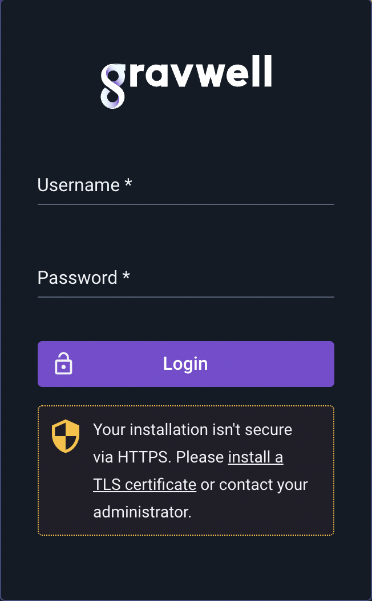

# DatalaiQのインストールをハード化する

DatalaiQのインストールをハード化するのは、非常に簡単なプロセスです。 私たちは、[最小特権の原則](https://en.wikipedia.org/wiki/Principle_of_least_privilege)を遵守し、十分に隔離された製品を出荷していることに誇りを持っています。 いくつかの基本的な調整と常識的な対策を超えて、DatalaiQのインストールをハード化することは、他のシステムのハード化と全く同じです。 DatalaiQは完全に非特権アカウントでユーザースペースで実行されます; それは実行されるシステムのなすがままです。

[Linux Audit](https://linux-audit.com/linux-server-hardening-most-important-steps-to-secure-systems/) のページには、Linux システムの一般的な堅牢化のための、いくつかの良いヒントがあります。ホストOSをロックダウンすれば、90%は解決です。

TLS証明書など、初期インストール時に注意が必要な部分がいくつかあります。 ほとんどのユーザーが満足するようなデフォルトのセットで出荷されていますが、微調整したい設定もいくつかあります。

また、DatalaiQの最新リリースを常に把握し、時折[changelog](../#!changelog/list.md)をチェックすることを強くお勧めします。 もしセキュリティ上の問題が発生した場合は、そこに記録されます。 また、重要なセキュリティ問題については、所定の連絡先を通じてお客様にお知らせします。

## クイックスタート

DatalaiQを保護することは、ネットワークからアクセス可能な他のアプリケーションを保護することと大差はありません。 デフォルトのパスワードを変更し、TLS証明書による適切な暗号化を設定し、パーミッションと認証トークンが強力であることを確認することです。

急いでいて、高いところだけを狙いたい場合は、こうします:

1. admin ユーザーのパスワードを変更する
2. 有効なTLS証明書をインストールし、HTTPSを有効にする [詳細情報](certificates.md)
3. admin ユーザーのユーザー名を変更する
4. インジェスターに適切なシークレットを使用し、暗号文接続を有効にする [More Info](../#!ingesters/ingesters.md)
5. パスワードの複雑性の制御](#!configuration/configuration.md#Password_Complexity) または [Single Sign On](#!configuration/sso.md) を有効化する。
6. サーチエージェントでHTTPS通信を有効にする [詳細情報](certificates.md)
7. ウェブサーバーとインデクサーの間の通信が、信頼できるネットワーク上にあることを確認する。

有効な TLS 証明書をインストールし、HTTPS を有効にすることは、admin ユーザーのデフォルト・パスワードを変更することよりもわずかに重要性が低いだけです。 ログイン時に、DatalaiQ が HTTPS を使用していないことを検出すると、ログインプロンプトに警告が表示されます。:



HTTPSを有効にし、有効なTLS証明書がなければ、攻撃者はログイン情報を盗聴することができます。したがって、HTTPSを有効にせずに公共のインターネットを介してDatalaiQに決してアクセスしないでください。

# DatalaiQのユーザーとグループ

DatalaiQのユーザーとグループは、Unixのパターンに緩やかに従っています。 高レベルでは、DatalaiQのアクセス制御は以下のルールに集約されます:

1. ユーザーは複数のグループに所属することができる
2. すべての検索、リソース、スクリプトは、1 人のユーザーが所有します。
3. 検索、リソース、スクリプト、ダッシュボードは、グループメンバーシップによって共有することができます。
4. グループメンバーシップによるアクセスでは、書き込み権限が付与されない（オーナーとアドミンだけが書き込み可能）。
5. 管理者ユーザーには何の制限もない (`root` と思ってください)
6. UID 1 の Admin ユーザーを削除したり、システムからロックアウトすることはできない (これも `root` と考えてください)
7. 複数のユーザに Admin 権限を与えることができる

ユーザーとグループの管理は、管理者ユーザーのみが責任を負うものとします。管理者以外のユーザーは、ユーザーを変更したり、ユーザーグループのメンバーシップを変更したりすることはできません。

## デフォルトアカウント

DatalaiQのデフォルトのインストールでは、`admin`という名前のユーザーと `changeme`というパスワードが1つだけ設定されています。 このデフォルトアカウントはUID 1を使用します。DatalaiQはUID 1を、UnixがUID 0を扱うのと同じように扱います。 これは特別なもので、削除したり、ロックしたり、その他の方法で無効にすることはできません。 このアカウントは慎重に保護する必要があります!

1という特別なUIDを持つ`admin`ユーザーを削除することはできませんが、ユーザー名を変更することは可能です；そうすることを **HIGHHLY** お勧めします。 これは、権限のないユーザーが認証情報を推測することをより難しくします。 このデフォルトのアカウントはあなたの注意を必要とするという点をさらに強調するために、アカウントの「実名」を「Sir changeme of change my password the third」に設定しました。 まじめな話、まず最初にすべきことは、このアカウントをロックダウンすることです。

デフォルトのインストールでは、基本的な `users` グループも含まれています。 このグループは単なる出発点であり、特別な特権を持ちません。

### アカウントの保存とパスワードのハッシュ化

DatalaiQは、[bcrypt](https://en.wikipedia.org/wiki/Bcrypt)ハッシュシステムを使用して、ログインの保存と検証を行います。 これは、パスワードが平文で保存されることは決してなく、復元する方法もないことを意味します。

bcryptのハッシュコストは12とかなり強気でスタートし、そのコストを上げる必要があるかどうかを定期的に再検討しています。

## 搭載部品

デフォルトでは、DatalaiQは `/opt/gravwell` にインストールされます。 インストーラーはユーザーとグループ `gravwell`:`gravwell` を作成します。 ユーザーもグループもログイン権限を持ってインストールされるわけではありません。 すべてのコンポーネントは `gravwell` ユーザーの下で実行され、ほとんどすべてのコンポーネントは `gravwell` グループの下で実行されます。

注目すべき例外はFile Followerインジェスターで、これは`admin`グループの下で実行され、`/var/log`のログファイルを尾行できるようにします。 もし、DatalaiQ のコンポーネントを昇格した権限で実行させたくない場合は、[File Follower](#!ingesters/ingesters.md#File_Follower) を使用せず、代わりに [Simple Relay](#!ingesters/ingesters.md#Simple_Relay) ingester へ TCP 経由でデータを送るよう syslog を設定するよう勧めます。 また、制御されたシステムログファイルを追う必要がない場合は、File Follower の systemd ユニットファイルを変更して、`DatalaiQ` グループを使用して実行することもできます。 詳細は以下のシステム・ユニット・ファイルのセクションを参照してください。

DatalaiQインストーラには、リポジトリインストールパッケージ(Debian `.deb` または RedHat `.rpm`) とシェルベースの自己解凍型インストーラの2つの形式があります。 リポジトリインストールパッケージは、公開されているDatalaiQ [リポジトリキー](https://update.gravwell.io/debian/update.gravwell.io.gpg.key)を使ってすべて署名されています。 自己解凍型のシェルインストーラは、常に MD5 ハッシュが添付されています。パッケージ（DatalaiQ またはそれ以外）をインストールする前に、必ず MD5 ハッシュおよび/またはリポジトリ署名を検証してください。

## インストール設定ファイル

DatalaiQの設定ファイルは `/opt/gravwell/etc` に格納されており、ウェブサーバー、検索エージェント、インデクサー、インジェスターの動作を制御するために使用されます。 DatalaiQの設定ファイルは通常、認証に使用される共有秘密トークンを含んでいます。 共有秘密は、DatalaiQコンポーネントに対する様々なレベルの制御を可能にします。 例えば、`Ingest-Secret`が漏洩した場合、攻撃者は余計なエントリーをインデックスに送り、ストレージを消費しますが機密情報は漏洩しません。一方、`Control-Secret`が漏洩すると、攻撃者はインデクサ内のデータ全体を検索できるようになります。インジェストシークレットを除けば、ほとんどの場合、インデクサとウェブサーバのノードから離れる必要はありません。

## systemd ユニットファイル

DatalaiQ は、DatalaiQ の起動と実行、およびクラッシュレポートの管理のために [systemd](https://www.freedesktop.org/wiki/Software/systemd/) init マネージャに依存しています。 インストーラーは [systemd ユニットファイル](https://www.freedesktop.org/software/systemd/man/systemd.unit.html) を `/etc/systemd/system` に登録・インストールします。 これらのユニットファイルは、DatalaiQ プロセスの起動と、DatalaiQ プロセスの動作を保証するための cgroup 制約の適用を担当します。

ほとんどのユーザーは systemd ユニットファイルを変更する必要はありませんが、もしインジェスターが特定のリソースに触れることを許可したり、別のユーザーやグループとして実行したい場合は、`[Service]`セクションの `User` や `Group` パラメータをいじりたくなるかもしれません。

### Systemdのリソース制限

DatalaiQは、スピードとスケールのために構築されています。 私たちのお客様の多くは、非常に大規模なシステムで1日あたり数百ギガバイトを処理しており、私たちは高いコア数、大容量メモリ、高速ディスクを武器に活躍しています。 コアをお持ちですか？ 使えますよ。 しかし、Community Edition のユーザーや、DatalaiQ を他のシステムと共存させる必要があるユーザーは、DatalaiQ が利用可能なリソースを過剰に消費しないようにする必要があるかもしれません。 Systemd ユニット・ファイルは、Linux Cgroups を制御する機能を提供します。つまり、DatalaiQ によるメモリ、CPU、そしてシステム・ファイル記述子の使用を制限することができます。

DatalaiQ のためにシステムをハード化することは、DatalaiQ のためにシステムをハード化することでもあります。 Systemd は、DatalaiQ が一生懸命働いているときでも、システム・リソース全体のサブセットしか使用しないように、ちょっとした「壁」を作ることができます。 以下は、システムスレッド数、CPU使用率、常駐メモリ数を制限するsystemdユニットファイルの例です。

このインデクサを4スレッド、8GBの常駐メモリに制限し、その優先度を下げるためにプロセスにいい値を適用しています。 これは、インデクサがシステム上の他のプロセスよりもCPUの使用時間が短くなる傾向があることを意味します。

```
[Install]
WantedBy=multi-user.target

[Unit]
Description=Gravwell Indexer Service
After=network-online.target
OnFailure=gravwell_crash_report@%n.service

[Service]
Type=simple
ExecStart=/opt/gravwell/bin/gravwell_indexer -stderr %n
ExecStopPost=/opt/gravwell/bin/gravwell_crash_report -exit-check %n
WorkingDirectory=/opt/gravwell
Restart=always
User=gravwell
Group=gravwell
StandardOutput=null
StandardError=journal
LimitNOFILE=infinity
TimeoutStopSec=120
KillMode=process
KillSignal=SIGINT
LimitNPROC=4
LimitNICE=15
MemoryAccounting=true
MemoryHigh=7168M
MemoryMax=8192M
```

LimitNOFILE`パラメータを使用して、開いているファイルディスクリプタの数を制限していないことに注意してください。DatalaiQ はファイル記述子を慎重に扱いますが、開くことができる数を制限すると、大きな範囲を検索するときや多くのインジェスターが接続されているときにエラーを引き起こす可能性があります。 利用可能なすべてのシステム調整の完全なリストについては、freedesktop.org [exec](https://www.freedesktop.org/software/systemd/man/systemd.exec.html) のマニュアルをご覧ください。

## DatalaiQアプリケーション実行可能ファイル

すべてのDatalaiQサービス実行ファイル（Windowsインジェスターを除く）は `/opt/gravwell/bin` にインストールされ、ユーザー `gravwell` とグループ `gravwell` によって所有されています。 実行ファイルのパーミッションビットは `other` による読み取り、書き込み、実行を許可していません。 つまり、root と `gravwell`:`gravwell` のユーザーとグループのみがアプリケーションを実行したり読んだりすることができます。

一部のコンポーネントは、特別なユーザーまたはグループとして実行することなく特定のアクションを実行することができる特別な機能がインストールされています。 現時点では、DatalaiQコンポーネントは以下の2つの機能のみを利用します:

* `CAP_NET_BIND_SERVICE` - 非 root アプリケーションが 1024 未満のポートにバインドすることを許可します。
* `CAP_NET_RAW` - 非 root アプリケーションが raw ソケットを開くことを許可します。

`CAP_NET_RAW` 機能は [Network Capture](/#!ingesters/ingesters.md#Network_Ingester) インジェスターでのみ使われ、ルートとして実行せずにインターフェイスから生のパケットをキャプチャできるようにします。

`CAP_NET_BIND_SERVICE` 機能は [Simple Relay](/#!ingesters/ingesters.md#Simple_Relay) とウェブサーバーで使用され、ウェブサーバーの 80, 443 や Simple Relay ingester の 601, 514 など低い番号のポートに結合できるようにするものです。

## 検索スクリプトと自動化

DatalaiQオートメーション・システムは、非常に強力です。クエリーを実行し、リソースを更新し、外部システムにアクセスすることができます。 自動化スクリプト・システムは、[Turing Complete](https://simple.wikipedia.org/wiki/Turing_complete)言語によって支えられており、基本的に何でもできるようになっている。 しかし、大きな力には大きな責任が伴います。 ユーザーベースによっては、ユーザーができることを制限するために、スクリプトで「危険な」APIアクセスを無効にすることを望むかもしれません。 危険 "とみなされるAPIとは、HTTP、ネットワーク、SSH、FTP、SFTPなど、DatalaiQ以外の外部接続を確立できるAPIを指します。

リスクのあるAPIを無効にすることで、ユーザが機密データをエクスポートする機会を減らすことができます。 Gravwell.conf ファイルで以下を設定することで、これらの API を無効化できます:

`Disable-Network-Script-Functions=true`

備考: ネットワークスクリプト機能は非常に便利なので、ユーザーが悪用することを懸念する場合のみ無効にしてください。

[//]: # (# Query Controls)

## SELinuxに関する注意事項

DatalaiQのインストーラーは、SELinuxが有効になっている場合、SELinuxを適切に設定しようとします。この設定は次のように構成されています。:

* usr_t コンテキストを semanage コマンドで `/opt/gravwell/` (`bin` サブディレクトリを除く) にあるすべてのファイルに追加します。
* bin_t コンテキストを semanage コマンドで `/opt/gravwell/bin` にあるすべてのファイルに追加する。
* 新しいコンテキストルールを適用するために `restorecon` コマンドを使用します。

SELinux が DatalaiQ の実行を妨げていることがわかったら、`/sbin/semanage fcontext -l | grep /opt/gravwell` を使ってルールを確認してください。
