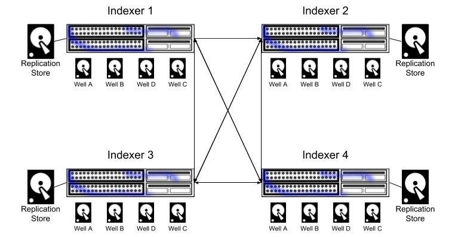
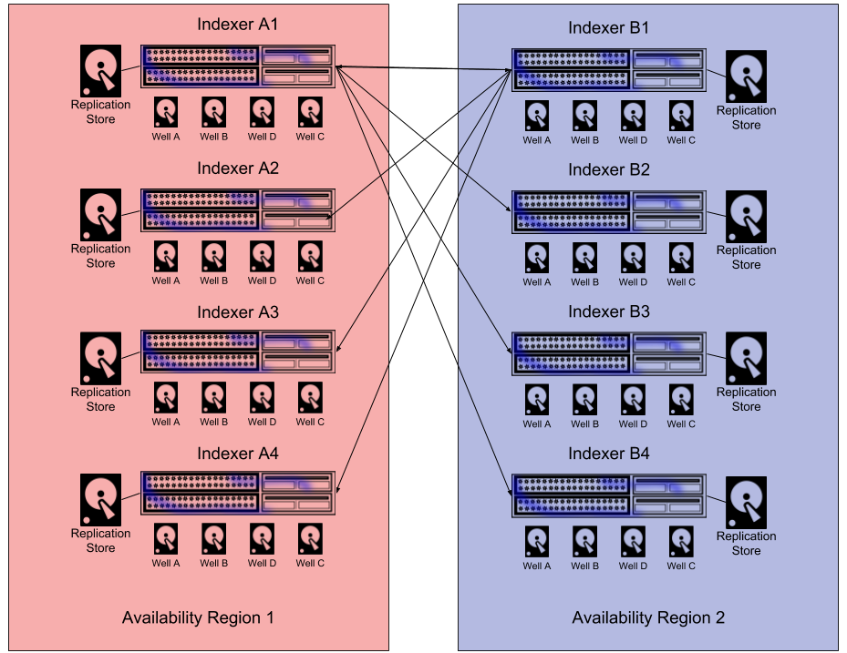
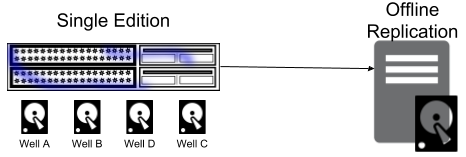
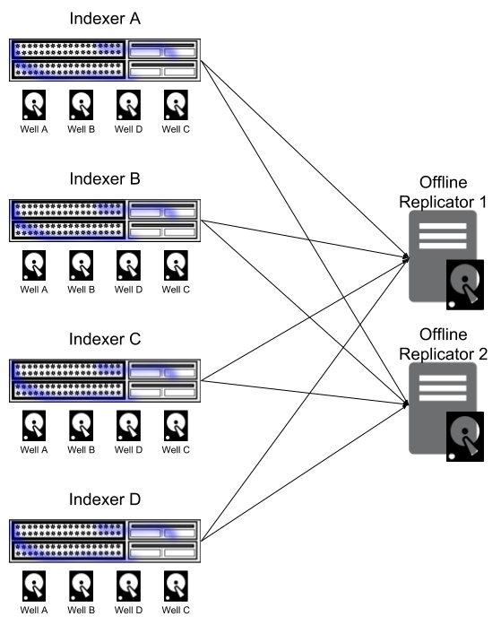

# データレプリケーション

レプリケーションは、すべての DatalaiQ Cluster Edition ライセンスに含まれており、フォールトトレラントな高可用性配備を可能にします。 DatalaiQ のレプリケーション・エンジンは、自動フェイルオーバー、負荷分散されたデータ配信、および圧縮を備えた分散型インデクサーのデータ・レプリケーションを透過的に管理します。 DatalaiQ はまた、どのウェルをレプリケーションに含めるか、そしてデータをどのようにピアに分散させるかについて、きめ細かな制御を提供します。 お客様は、均一なデータ配信を行う DatalaiQ クラスターを迅速に導入したり、地域を考慮したピア選択によりデータセンター全体の障害に耐えうるレプリケーション方式を設計したりすることができます。 また、オンラインフェイルオーバーシステムにより、一部のインデクサがオフラインの場合でもデータへのアクセスを継続することができます。

注意: DatalaiQのレプリケーション・システムは、純粋に取り込まれたデータを複製するために設計されています。ユーザーアカウント、ダッシュボード、検索履歴、リソースなどは、インデクサではなくWebサーバーに保存されるため、バックアップは行われません。ウェブサーバーに耐障害性を持たせるには、ウェブサーバーにデータストア(#!distributed/frontend.md)を導入することを検討してください。データストアは、ウェブサーバーのデータの冗長なライブコピーを保存します。

レプリケーションシステムは論理的に「クライアント」と「ピア」に分かれており、各インデクサはピアとしてもクライアントとしても機能する可能性があります。 クライアントは、既知のレプリケーション・ピアに連絡を取り、レプリケーション・トランザクションを推進する責任を負っています。 DatalaiQクラスタをレプリケーション・モードで展開する場合、レプリケーション・ストレージ・ノードとして機能するすべてのピアに対して、インデクサがTCP接続を開始できることが重要です。

レプリケーション接続はデフォルトで暗号化されており、インデクサが機能するX509証明書を持っていることが必要です。 もし、証明書が有効な認証局（CA）によって署名されていない場合は、レプリケーション設定セクションに `Insecure-Skip-TLS-Verify=true` を追加する必要があります。

レプリケーション・ストレージ・ノード（複製されたデータを受信するノード）には特定のストレージ量が割り当てられており、そのストレージを使い切るまでデータを削除することはありません。 リモートクライアントノードが通常のエージアウトの一環としてデータを削除した場合、データシャードは削除済みとマークされ、レプリケーションノードがストレージの制限に達したときに削除が優先されます。 レプリケーションシステムは、削除済みシャードを最初に、コールドシャードを2番目に、最も古いシャードを最後に優先的に処理します。 レプリケートされたデータはすべて圧縮されます。コールドストレージが提供されている場合、通常、レプリケーションストレージはコールドストレージとホットストレージを合わせたのと同じストレージ容量を持つことが推奨されます。

注意: 999MBを超えるエントリーはレプリケートされません。これらは通常通り取り込まれ、検索されますが、レプリケーションからは除外されます。

## 基本的なオンラインデプロイメント

最も基本的なレプリケーション展開は、すべてのインデクサが他のすべてのインデクサに対してレプリケーションできる一様な分布です。 均一な配置は、Replication Peer フィールドで他のすべてのインデクサを指定することで構成されます。



### 設定例

3台のインデクサ（192.168.100.50, 192.168.100.51, 192.168.100.52） を想定すると、192.168.100.50のインデクサの設定は以下のようになります。:

```
[Replication]
	Peer=192.168.100.51
	Peer=192.168.100.52
	Storage-Location=/opt/gravwell/replication_storage
	Insecure-Skip-TLS-Verify=true
	Connect-Wait-Timeout=60
```

各ノードは `Peer` フィールドで他のノードを指定する。

## リージョン・アウェア・デプロイメント

レプリケーションシステムは、インデクサにデータの複製を許可するピアを細かく設定することができる。 レプリケーション・ピアーを制御することで、ある地域全体をオフラインにしても、オンラインのアベイラビリティ・ゾーンでその後の損失が発生しない限り、データを失うことなくアベイラビリティ・ゾーンを設定することが可能である。



### 設定例

例えば、8ノードのクラスタを2つのアベイラビリティ・ゾーン（1および2）に分割することができます。 アベイラビリティ・ゾーン1のサブネットが 172.16.2.0/24 で、アベイラビリティ・ゾーン2のサブネットが 172.20.1.0/24 であったとすると、アベイラビリティ・ゾーン1は 172.16.2.0/24 のサブネットになります。

リージョン1のノードは、リージョン2にレプリケートされるように設定されています。:

```
[Replication]
	Peer=172.20.1.101
	Peer=172.20.1.102
	Peer=172.20.1.103
	Peer=172.20.1.104
	Storage-Location=/opt/gravwell/replication_storage
	Connect-Wait-Timeout=60
```

リージョン2のノードは、リージョン1にレプリケートされるように設定されています。:

```
[Replication]
	Peer=172.16.2.101
	Peer=172.16.2.102
	Peer=172.16.2.103
	Peer=172.16.2.104
	Storage-Location=/opt/gravwell/replication_storage
	Connect-Wait-Timeout=60
```

## オフラインデプロイメント

レプリケーションは、標準のSingle Edition DatalaiQライセンスには含まれていません。 お客様の組織がDatalaiQのマルチノード展開を必要としないが、管理バックアップのためにレプリケーション・エンジンへのアクセスを希望する場合は、<support@ppln.co>に連絡して、シングル・エディション・ライセンスをレプリケーション・シングル・エディション・ライセンスにアップグレードしてください。 Single Editionのレプリケーションは完全にオフラインです。つまり、インデックス作成がオフラインになった場合、インデクサがオンラインに戻って復旧が完了するまで、データを検索することができません。



クラスタ版のDatalaiQライセンスは、オフライン・レプリケータを使用してオフライン・レプリケーション構成を実装することができます。 オフライン・レプリケーターは、レプリケーション・ピアとしてのみ機能し、自動フェイルオーバーやインデクサとしての機能は提供しません。 オフラインレプリケーション構成は、ストレージシステムがすでに冗長ストアにバックアップされており、損失の可能性が極めて低いクラウド環境において有効です。 オフラインレプリケーション構成を使用することで、データを低コストなインスタンスに複製することができます。このインスタンスは、インデクサとしてうまく機能しない非常に低コストのストレージプールに接続されています。 万が一、インデクサが完全に失われた場合、低コストのレプリケーション・ピアは高コストのインデクサ・インスタンスを復元することができます。 オフライン・レプリケーション・パッケージへのアクセスについては、<support@ppln.co>にお問い合わせください。



## 設定オプション

レプリケーションは、gravwell.conf設定ファイルの「Replication」設定グループによって制御されます。 Replication設定グループには、以下の設定パラメータがあります。

| Parameter | Example | Description |
|:----------|:--------|------------:|
| Peer      | Peer=10.0.0.1:9406 | レプリケーションストレージノードとして動作するリモートシステムを指定する。 複数のPeerを指定することができます。 |
| Listen-Address | Listen-Address=10.0.0.101:9406 | レプリケーションシステムがバインドするアドレスを指定します。 デフォルトでは、TCPポート9406のすべてのアドレスでリッスンします。 |
| Storage-Location | Storage-Location=/mnt/storage/gravwell/replication | レプリケーション用ストレージに使用するフルパスを指定します。 |
| Max-Replicated-Data-GB | Max-Replicated-Data-GB=4096 | レプリケーションシステムが消費する最大ストレージ量を指定します（この場合は4TB）。 |
| Replication-Secret-Override | Replication-Secret-Override=replicationsecret | レプリケーションピアへの接続を確立する際に使用される認証トークンを上書きします。 デフォルトでは、Global Configuration グループの "Control-Auth" トークンが使用されます。|
| Disable-TLS | Disable-TLS=true | レプリケーションピア間のTLS通信を無効にします。デフォルトはfalse（TLSが有効）です。 |
| Insecure-Skip-TLS-Verify | Insecure-Skip-TLS-Verify=true | TLS 公開鍵の検証および妥当性確認を無効にします。 TLS は引き続き有効ですが、システムは相手から提示された任意の公開鍵を受け入れます。 |
| Key-File | Key-File=/opt/gravwell/etc/replicationkey.pem | レプリケーション接続のネゴシエーションに使用されるX509秘密鍵を上書きします。 デフォルトでは、TLS接続はグローバルキーファイルを使用します。 |
| Certificate-File | Certificate-File=/opt/gravwell/etc/replicationcert.pem | レプリケーション接続のネゴシエーションに使用されるX509公開鍵証明書を上書きします。 デフォルトでは、TLS接続はグローバル証明書ファイルを使用します。 |
| Connect-Wait-Timeout | Connect-Wait-Timeout=30 | 起動時にレプリケーションピアへの接続を試みる際に、Indexerが待つべき秒数を指定します。 |
| Disable-Server | Disable-Server=true | インデックス・レプリケーション・サーバーを無効にし、クライアントとしてのみ動作するようにします。 これは、オフライン・レプリケーションを使用する場合に重要です。 | 
| Disable-Compression | Disable-Compression=true | レプリケートされたデータ用のストレージの圧縮を無効にする。 |
| Enable-Transparent-Compression | Enable-Transparent-Compression=true | 複製されたデータにホストファイルシステムを使用する場合、透過的圧縮を有効にします。 |

## レプリケーションエンジンの動作

レプリケーションエンジンは、インジェストや検索への影響を最小限にするために設計されたベストエフォート型の非同期レプリケーション・リストアシステムである。 レプリケーションシステムはベストエフォート型のデータ配信を試みますが、タイムリーな割り当てと配信に重点を置いています。 つまり、シャードは分散された先着順で割り当てられ、以前の配布に基づくガイダンスもあります。 システムは完全に均一なデータ配布を試みるわけではなく、スループット（帯域幅、ストレージ、CPUのいずれか）の高いレプリケーション・ピアは、低いピアよりも大きなレプリケーション・ロードを引き受ける可能性があります。 データレプリケーションをサポートする目的でDatalaiQクラスタートポロジーを設計する場合、予期せぬバーストや完全に均一でないデータ配布に対応するため、レプリケーションストレージを10～15%オーバープロビジョニングすることをお勧めします。

レプリケーションエンジンは、タグと実際のエントリーの2つのコアデータのバックアップを保証します。 印刷可能なタグ名とストレージIDのマッピングは、各インデクサによって独立して維持され、効果的な検索に不可欠です。 タグから名前へのマップは比較的小さいため、すべてのインデクサはそのマップ全体を他のすべてのレプリケーションピアに複製します。 一方、データは一度だけ複製されます。

レプリケーションは、データのエージアウト、マイグレーション、ウェルアイソレーションと連携するように設計されています。 インデクサがデータをコールドストレージプールにエージアウトするか、完全に削除すると、データ領域はリモートストレージピア上でコールドまたは削除とマークされます。 リモートストレージピアは、ノード障害時にどのデータを保持および/または復元するかを決定する際に、削除、コールドストレージ、およびシャードの年齢を使用します。 データがインデクサによって削除済みとマークされている場合、インデクサに障害が発生し、レプリケーションによって回復する場合、そのデータはリストアされません。 コールドとしてマークされたデータは、リストア時にコールド・ストレージ・プールに直接戻されます。 レプリケーションを使用して復旧する場合、インデキサーは故障前とまったく同じ状態に自分自身を復元する必要があります。

###  ベストプラクティス

高可用性DatalaiQクラスタの設計と導入は、いくつかの基本的なベストプラクティスに従う限り、簡単に行うことができます。 以下のリストは、DatalaiQクラスタ・インスタンスを展開および回復する際に従うべきガイドラインを示したものです。
 
1. Indexer-UUID` はインデクサーのグローバルIDを表します。 この ID はノードの存続期間中維持されなければならず、また故障の後にも適切に復元されなければなりません。 故障したインデックスが以前使用していたものと異なる UUID で現れた場合、それはレプリケーションクラスターのまったく新しいメンバーとして解釈され、以前のデータはリストアされません。インデクサーの致命的な故障に備え、インデクサーのUUIDを安全な場所にメモしておくことをお勧めします。
2. ウェル構成を変更すると、レプリケーションの状態に影響を与える可能性があります。 ウェルの追加や削除は全く問題ありませんが、障害発生後、復旧前にウェル構成を変更すると、レプリケーションエンジンが適切にデータを復元できなくなります。
3. インデクサに障害が発生した場合、新しいデータを取り込む前に、レプリケーション・ピアとの接続を確立し、第一レベルのタグ同期を行うことができるようにすることが極めて重要です。 Connect-Wait-Timeout`設定パラメータをゼロに設定し、レプリケーション接続を確立してタグの復元を行うまで、故障したインデクサが起動しないようにするのはよい考えです。
4. レプリケーション・ストレージのロケーションは、1つのレプリケーション・システム専用に予約する必要があります。 例えば、複数のインデクサーの `Storage-Location` に同じネットワーク接続ストレージを使用すると、レプリケーションの失敗やデータ破損の原因となります。
5. レプリケートデータとプライマリデータの圧縮方式を一致させる。 インデクサでホストベースの透過的圧縮を使用している場合、レプリケーションストアでその動作を真似ることが最善です。 インデクサとレプリケーション・ピアで圧縮方式を一致させると、リストア処理が劇的に速くなります。

## トラブルシューティング

以下は、レプリケーションの問題をデバッグする際に考えられる問題点と解決策です。

#### 障害発生後、インデクサーのデータが復元されないことがある
オンラインに戻ったとき、インデクサがそのオリジナルの `Indexer-UUID` 値を維持していることを確認します。 UUIDが変更された場合、元の値に戻し、インデクサがすべてのデータを復元するのに十分な時間があることを確認します。 インデックス作成者の UUID を変更した後のリストアは、レプリケーションシステムが 2 つの異なるデータストアを統合するため、より多くの時間を必要とする場合があります。

#### レプリケーションでデータが表示されない Storage-Location
すべてのレプリケーションピアが共通の `Control-Auth` (または `Replication-Secret-Override`) 値を持っていることを確認してください。 ピア同士が認証できない場合、データを交換することはできません。

X509証明書は、ホストシステム上の鍵ストアが尊重する有効な認証局(CA)によって署名されていることを確認します。 証明書ストアが有効でない場合、ホストマシンの証明書ストアに公開鍵をインストールするか、 `Insecure-Skip-TLS-Verify` オプションでTLS検証を無効にしてください。

注意: `Insecure-Skip-TLS-Verify`によってTLS検証を無効にすると、レプリケーションが中間者攻撃にさらされるようになります。 攻撃者は飛行中のデータを変更することができ、ログを破損したり、複製されたデータの活動を隠したりする可能性があります。

ファイアウォールルールやルーティングACLをチェックして、インデクサが指定されたポートで互いに通信することが許可されていることを確認します。

#### タグの結合に失敗したため、インデクサーの起動が拒否されます
インデクサが障害発生後、タグマッピングを復元する前にインジェストを開始すると、レプリケーションノードのタグマップがマージできない状態になる可能性があります。 マージできないタグのエラーが発生した場合は、<support@ppln.co>に連絡して、障害が発生したノードを手動で復元するための支援を受けてください。
 
#### 障害発生後、インデクサが全データをリストアしない
レプリケーション・ピアは、ストレージの性能低下、ネットワークの性能低下、またはレプリケーション・ノードのストレージ障害により、インデクサに追いつくことができなかった可能性があります。 レプリケーション・ピアに、インジェストに追いつくのに十分な帯域幅とストレージ容量があることを確認します。 ストレージノードが1秒間に数百メガバイトのデータを取り込んでいる場合、レプリケーションピアも同じ速度でデータの計算、転送、保存を行えるようにする必要があります。

また、レプリケーション・ピアに十分なストレージがあることを確認してください。 ストレージノードが10TBのコールドデータと1TBのホットデータを保持するように構成されている場合、レプリケーションピアには少なくとも11TBのデータを保存する能力が必要です。 レプリケーションノードに過負荷がかかっていたり、誤った構成になっていたりすると、古いデータが削除されている可能性があります。

レプリケーションノードとインデクサーのシステム時刻が一致していることを確認してください。 両システムは、ウォールクロック時間を使用して、削除するデータの適格性を判断します。 インデクサのシステム時間が正しくない場合、レプリケーションピアがストレージを使い果たしたときに、インデクサのデータが優先的に削除される可能性があります。
