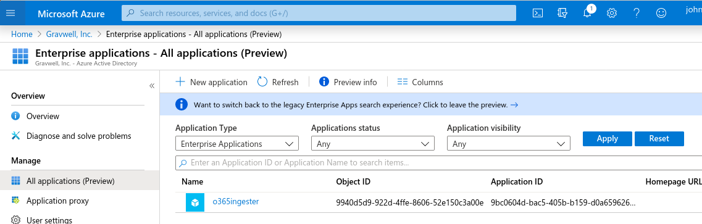
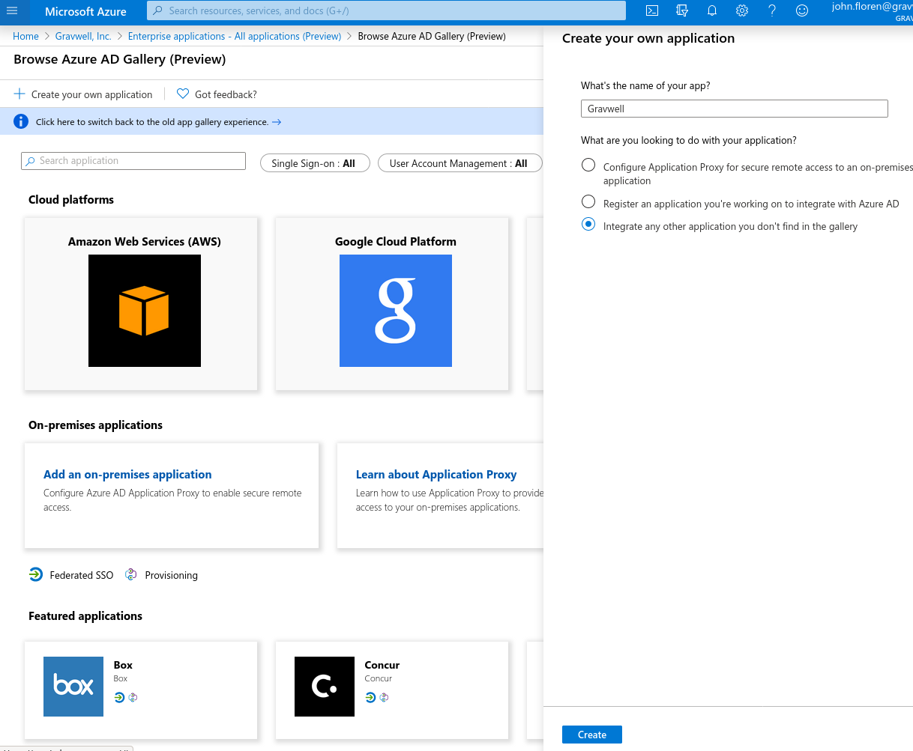
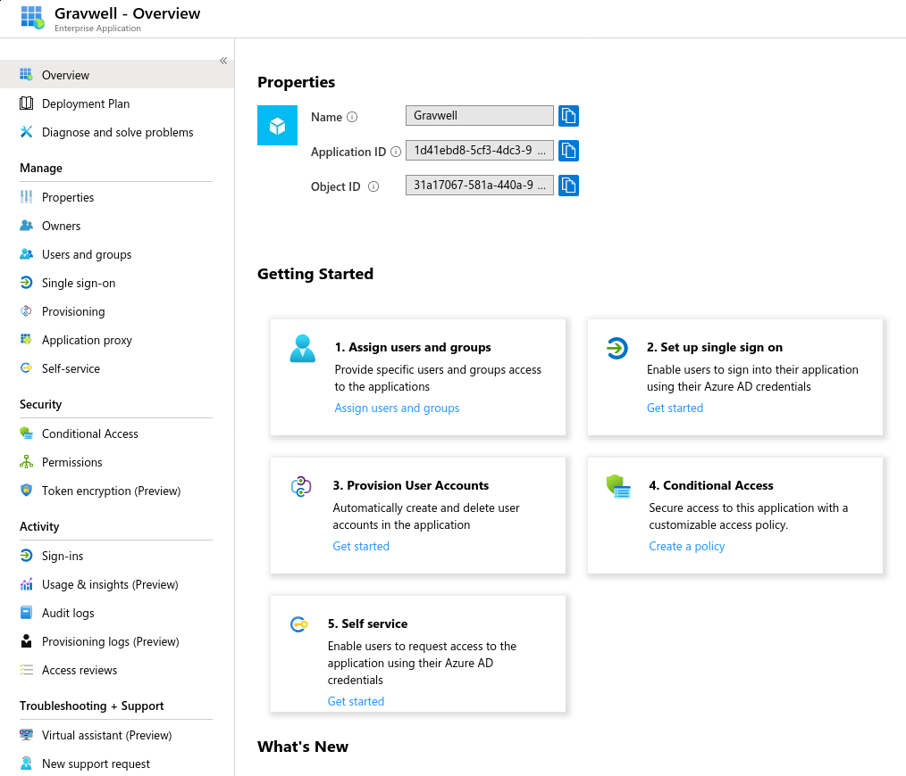
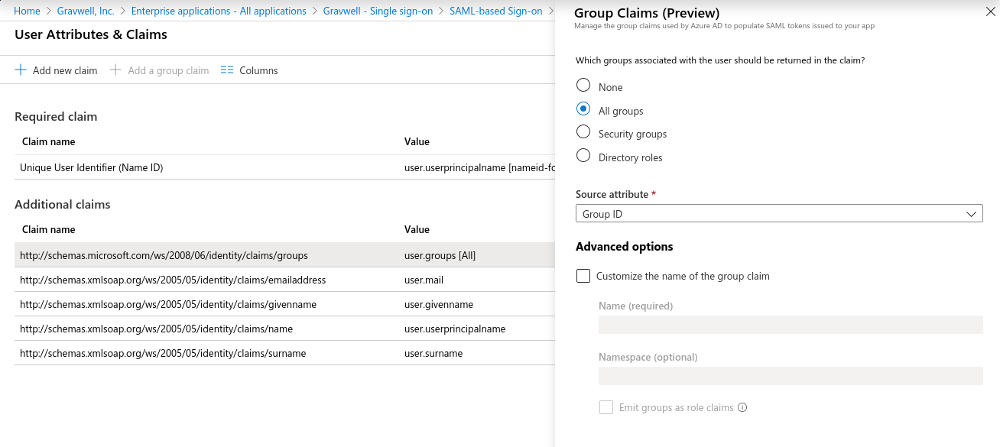
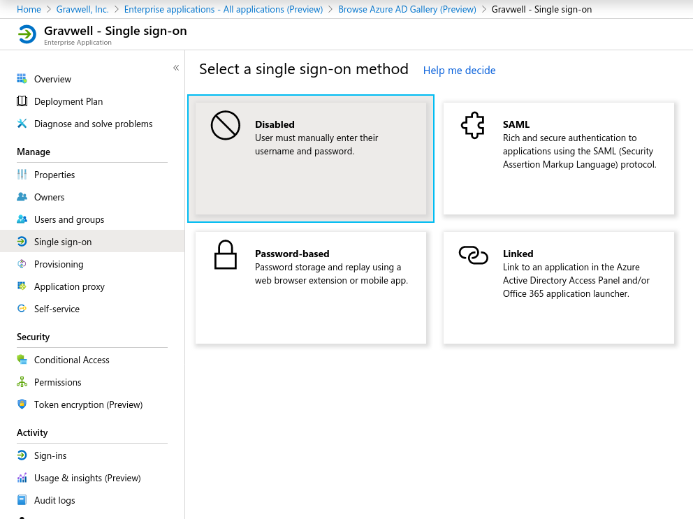
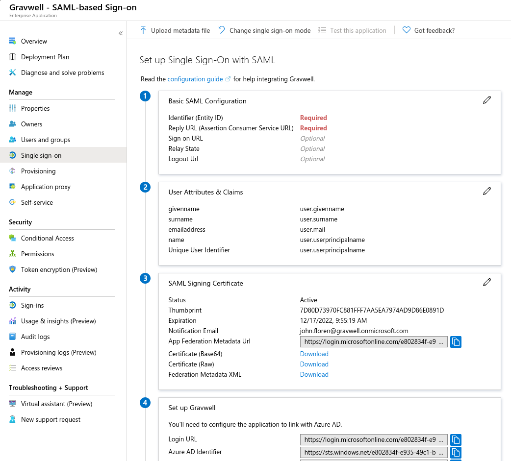
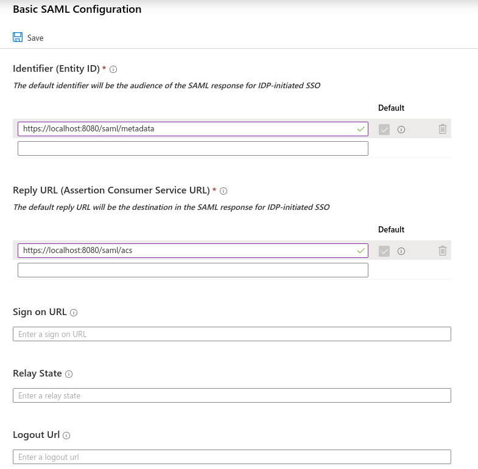
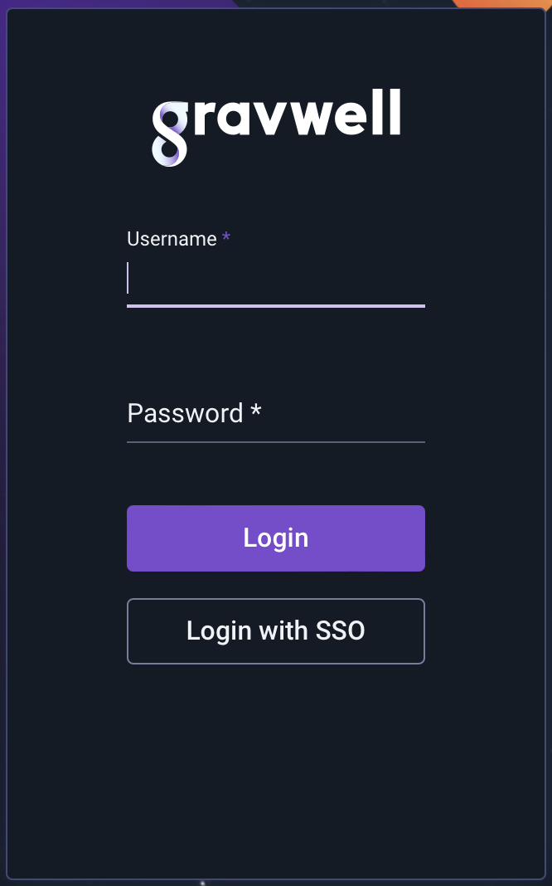
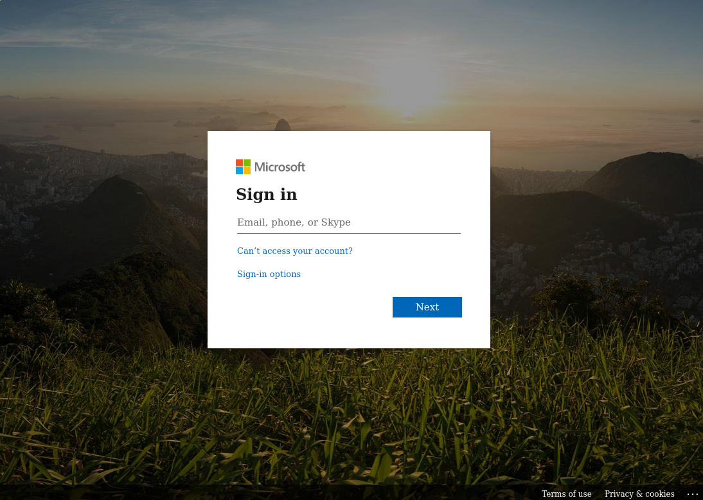

# Azure Active DirectoryのSSOを設定する

MicrosoftのAzure Active Directoryサービスは、クラウドベースの認証とシングルサインオンを提供します。DatalaiQは、認証のためにAzure ADと統合することができます。実際、これは最も簡単にセットアップできるSSOサービスの1つです。

DatalaiQにAzure AD SSOを設定するためには、以下のものが必要です:

* エンタープライズアプリケーションとSSOを作成できるAzure Premiumライセンスまたは同等のもの（お客様のニーズを確認するためにMicrosoftの営業にお問い合わせください。）.
* DatalaiQのWebサーバーは[TLS証明書とHTTPS](#!configuration/certificates.md)を設定可能です。

DatalaiQのSSO設定詳細は必要であれば[こちら](#!configuration/sso.md)をご覧ください。

 備考: この文書では、DatalaiQウェブサーバーのURLを`https://datalaiq.example.com/`と仮定します。

## Azureでアプリケーションを作成する

DatalaiQの認証は、Azureに「Enterprise Application」を作成することで管理します。Azure Active Directoryのコンソールで、「Enterprise Applications」を選択し、「New Application」ボタンを選択します:



新しいアプリケーションを作成するためのオプションが表示された新しい画面が表示されます。左上の「Create your own application」を選択し、表示されるフォームに必要事項を入力します:



[作成]をクリックすると、作成したアプリケーションの管理画面が表示されます:



まず、"Assign users and groups "を選択し、DatalaiQへのログインを許可するユーザーやグループを選択します。"DatalaiQ Users "グループを作成すると、シンプルになります:



次に、左側のメニューで「シングルサインオン」を選択し、表示された画面で「SAML」を選びます:



SAMLの設定画面が表示されます:



 SAML基本設定」カードの鉛筆アイコンをクリックします。Identifier "と "Reply URL "フィールドを入力する必要があります。"Identifier" には、DatalaiQ サーバーのメタデータ・ファイルの URL を指定します（例：`https://datalaiq.example.com/saml/metadata`）。"Reply URL" は、DatalaiQ の SSO 応答 URL になります。例：`https://datalaiq.example.com/saml/acs`。:



基本構成を保存する。SAML のメイン設定画面に戻り、「App Federation Metadata URL」というフィールドを見つけて、そこに含まれる URL をコピーします。https://login.microsoftonline.com/e802844f-e935-49c1-ba4e-b42442356fe1/federationmetadata/2007-06/federationmetadata.xml?appid=1d41efd8-5cf3-4ac3-9ad3-e3874f48cadc` のように見えるはずですが、URL の UUID は異なるでしょう。

## DatalaiQを設定する

Webサーバで `gravwell.conf` を開き、SSOセクションを作成します:

```
[SSO]
	Gravwell-Server-URL=https://gravwell.example.org
	Provider-Metadata-URL=https://login.microsoftonline.com/e802844f-e935-49c1-ba4e-b42442356fe1/federationmetadata/2007-06/federationmetadata.xml?appid=1d41efd8-5cf3-4ac3-9ad3-e3874f48cadc
	Common-Name-Attribute=http://schemas.microsoft.com/identity/claims/displayname
	Username-Attribute=http://schemas.xmlsoap.org/ws/2005/05/identity/claims/name
```

`Gravwell-Server-URL` を DatalaiQ Web サーバを指すように変更し（必要に応じて IP アドレスでも構いません）、次に `Provider-Metadata-URL` に前のセクションでコピーした "App Federation Metadata URL" を設定します。他の2つのパラメータはそのままで大丈夫です。

注意: `Provider-Metadata-URL` オプションは必ず設定しなければならない(MUST)。

ここで DatalaiQ ウェブサーバーを再起動してください (`systemctl restart gravwell_webserver.service`). もしそうでなければ、設定にタイプミスがないか、また `/dev/shm/gravwell_webserver.service` と `/opt/gravwell/log/web/` でエラーがないか確認してください。

## SSOを試験する

DatalaiQを再起動すると、ログインページに「Login with SSO」ボタンが表示されるはずです:



クリックすると、マイクロソフトのログインページが表示されます:



DatalaiQ アプリケーションにアクセスするために設定したユーザーのうちの 1 人としてログインします。ログインが完了すると、Azureユーザーと同じユーザー名でログインしたDatalaiQのWebサーバーにリダイレクトされるはずです。

## グループに関する注意事項

DatalaiQは自動的にグループを作成し、[SSOのページに記載されている](#!configuration/sso.md)グループとしてユーザーを追加します。 アプリケーションの User Attributes & Claims 設定ページで 'Add a group claim' をクリックすると、Azure AD がグループ付きのクレームを送信するように設定できます:


グループを有効にするには、どの属性にグループのリストが含まれているかを DatalaiQ に伝え、Azure グループ ID (UUID として送信される) から DatalaiQ の希望のグループ名へのマッピングを指定する必要があります。Azure Object ID = dc4b4166-21d7-11ea-a65f-cfd3443399ee のグループを「datalaiq-users」という名前にしたい場合、gravwell.conf の SSO セクションに以下の内容を追加します。:

```
	Groups-Attribute=http://schemas.microsoft.com/ws/2008/06/identity/claims/groups
	Group-Mapping=dc4b4166-21d7-11ea-a65f-cfd3443399ee:gravwell-users
```
