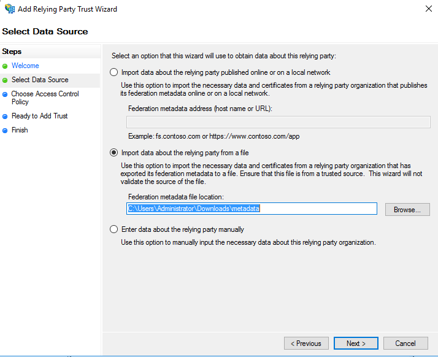
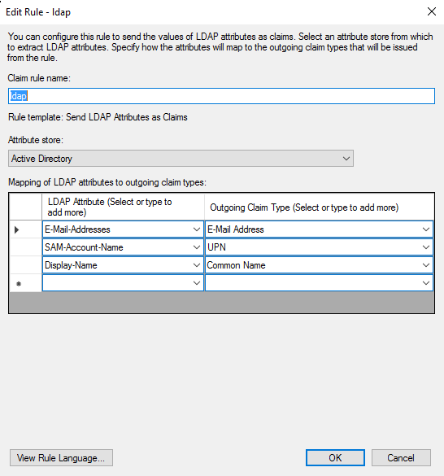
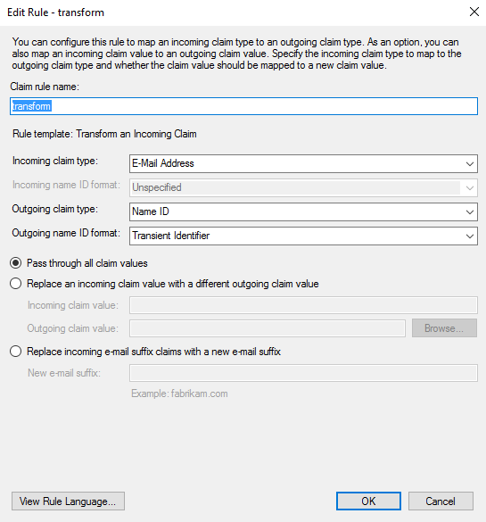
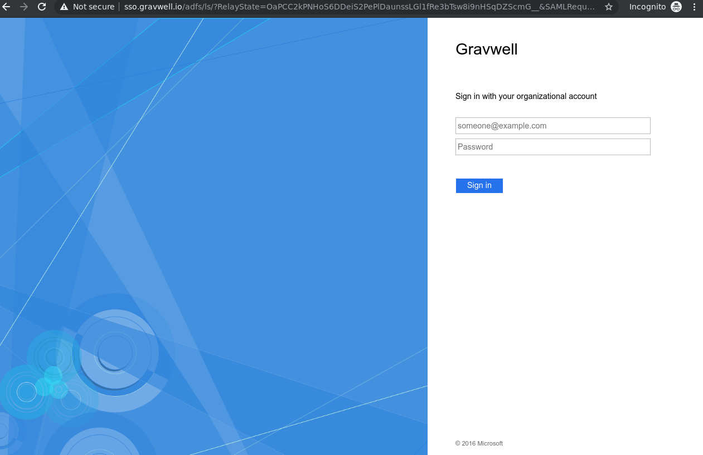

# DatalaiQシングルサインオン

DatalaiQのGUIは、SAMLを使用したシングルサインオンをサポートしています。理論的には、あらゆるSAML準拠のIDプロバイダーをログインに使用することができます。このページでは、DatalaiQのSSO設定オプションについて説明し、DatalaiQがWindows AD FSサーバーで認証されるように設定される例を紹介します。

備考: 一般ユーザーはSSOでログインしますが、デフォルトの「admin」ユーザーはログインしません。SSOをすぐに設定した場合でも、新しいシステムをセットアップする際には、adminユーザーのパスワードを必ず変更するようにしてください。また、DatalaiQのadminユーザーは、必要に応じてGUI内から新しい非SSOユーザー・アカウントを作成することができることに注意してください。

## DatalaiQ SSO設定パラメータ

DatalaiQインスタンス上でSSOを有効にするには、Webサーバの`gravwell.conf`ファイルにSSOセクションを挿入する必要があります。以下は、Windows AD FSサーバーで動作する最小限の構成です。:

```
[SSO]
	Gravwell-Server-URL=https://gravwell.example.org
	Provider-Metadata-URL=https://sso.example.org/FederationMetadata/2007-06/FederationMetadata.xml
```

以下は、SSOの基本的な設定パラメータです:

* `Gravwell-Server-URL` (required): は、SSO サーバーがユーザーを認証した後にリダイレクトされる URL を指定します。これは、DatalaiQサーバーのユーザー向けホスト名またはIPアドレスである必要があります。
* `Provider-Metadata-URL` (required): は、SSOサーバーのXMLメタデータのURLを指定します。上記のパス（`/FederationMetadata/2007-06/FederationMetadata.xml`）はAD FSサーバーで動作するはずですが、他のSSOプロバイダーでは調整が必要な場合があります。
* `Insecure-Skip-TLS-Verify` [default: false]: このパラメータを true に設定すると、SSO サーバーと通信する際に無効な TLS 証明書を無視するよう DatalaiQ に指示します。このオプションの設定には注意が必要です。

以下は、SSOプロバイダーに基づいて調整する必要があるかもしれない、より高度なパラメータです。デフォルトは、Microsoft AD FS サーバーに適しています。

* `Username-Attribute` [default: "http://schemas.xmlsoap.org/ws/2005/05/identity/claims/upn"]: ユーザー名を含む SAML 属性を定義する。Shibbolethサーバでは、代わりに "uid "を設定する必要がある。
* `Common-Name-Attribute` [default: "http://schemas.xmlsoap.org/claims/CommonName"]: ユーザーの "コモンネーム "を含むSAML属性を定義する。Shibbolethサーバでは、この代わりに "cn "を設定する必要があります。
* `Given-Name-Attribute` [default: "http://schemas.xmlsoap.org/ws/2005/05/identity/claims/givenname"]: ユーザーの与えられた名前を含む SAML 属性を定義する。Shibbolethサーバでは、この代わりに "givenName "を設定する必要があります。
* `Surname-Attribute` [default: "http://schemas.xmlsoap.org/ws/2005/05/identity/claims/surname"]: ユーザの姓を含む SAML 属性を定義します。
* `Email-Attribute` [default: "http://schemas.xmlsoap.org/ws/2005/05/identity/claims/emailaddress"]: ユーザの電子メールアドレスを含む SAML 属性を定義する。Shibbolethサーバでは、この代わりに "mail "を設定する必要があります。

DatalaiQは、ユーザのログイン応答でグループメンバーシップのリストを受け取り、必要なグループを自動生成して、ユーザをそれらのグループに追加するように設定することができます。これを有効にするには、`Groups-Attribute` を設定し、少なくとも1つの `Group-Mapping` を定義する必要があります。:

* `Groups-Attribute` [default: "http://schemas.microsoft.com/ws/2008/06/identity/claims/groups"]: ユーザが所属するグループのリストを含む SAML 属性を定義します。通常、グループリストを送信するように SSO プロバイダを明示的に構成する必要があります。
* `Group-Mapping`: ユーザーのグループメンバーとして登録されている場合、自動的に作成されるグループの一つを定義します。これは、複数のグループを許可するために複数回指定することができます。引数はコロンで区切られた2つの名前で構成される必要があります。1つ目はグループのSSOサーバー側の名前（通常、AD FSの名前、AzureのUUIDなど）、2つ目はDatalaiQが使用する名前です。したがって、もし私たちが 
* `Group-Mapping=Gravwell Users:gravwell-users`, グループ「DatalaiQ Users」のメンバーであるユーザーのログイントークンを受け取った場合、「gravwell-users」という名前のローカルグループを作成し、そのユーザーを追加することになります。

## 例: Azure Active Directoryのセットアップ

Azure Active DirectoryでSSOを設定するためのドキュメントは、独自のページに分離されています。[こちら](sso-azure/azure.md)をクリックしてお読みください。

## 例: Windows Server 2016のセットアップ

DatalaiQのSSOは、Windows Serverで提供されているMicrosoftのAD FS（Active Directory Federation Services）と相性が良い。ここでは、SSO認証のためにAD FSとDatalaiQを設定する方法について説明します。

事前にサーバーにActive DirectoryとAD FSがインストールされている必要があります。これらのサービスの基本的なインストールと設定は、このドキュメントの範囲外です。SSOを設定する場合、おそらくすでにActive Directoryが設定されていると仮定します

注意: DatalaiQで使用する予定のユーザー・アカウントには、Active Directoryで設定された電子メールアドレスが必要不可欠です! これは、DatalaiQの内部でのユーザー名として使用されます。イベントログにEventID 364のエラーが表示される場合は、これが原因です!

### DatalaiQの設定

AD FSを構成するには、DatalaiQインスタンスのSSOメタデータ・ファイルが必要です。そのため、まずDatalaiQをセットアップします。DatalaiQ GUIにSSOボタンが表示されますが、これはAD FSを設定するまで無効になっています。SSOを有効にするには、DatalaiQウェブサーバーにTLS証明書（自己署名入りまたはそれ以外）を設定する必要があります。

gravwell.conf`を開き、[Global]`セクションの下に[SSO]`セクションを追加してください。AD FSサーバが "sso.example.org "で、DatalaiQ Webサーバが "gravwell.example.org "の場合、設定は次のようになります。:

```
[SSO]
	Gravwell-Server-URL=https://gravwell.example.org
	Provider-Metadata-URL=https://sso.example.org/FederationMetadata/2007-06/FederationMetadata.xml
```

何らかの理由でAD FSサーバで自己署名証明書を使用している場合は、`Insecure-Skip-TLS-Verify=true`をセクションに追加する必要があります。

DatalaiQ ウェブサーバーを再起動します (`systemctl restart gravwell_webserver.service`). もしそうでなければ、設定にタイプミスがないか、また `/dev/shm/gravwell_webserver.service` と `/opt/gravwell/log/web/` でエラーがないか確認してください。

### 信頼できるパーティの追加

次に、DatalaiQからの認証要求を受け入れるために、AD FSサーバーを設定する必要があります。AD FSの管理ツールを開き、"Add Relying Party Trust "を選択する。:


Add Relying Party Trust ウィザードが起動します。最初にClaims-AwareかNon-Claims-Awareかを尋ねられますので、Claims-Awareを選択してStartをクリックします。

ここで、DatalaiQサーバーに関するメタデータ情報をAD FSに取り込むための方法を2つのうち1つ選択する必要があります。DatalaiQサーバーが適切に署名されたTLS証明書を使用している場合、最初のオプションの「Federation metadata address」フィールドにURLを入力し、「next」をクリックするだけでよい。:


ただし、DatalaiQが自己署名証明書を使用している場合は、最初にメタデータを手動でダウンロードする必要があります。ウェブブラウザを開き、`https://gravwell.example.org/saml/metadata`にアクセスします。プロンプトが表示されたらファイルを保存し、ウィザードに戻り、2番目のオプションで適切なパスを設定します。:



ウィザードの次のページで、表示名を設定するよう促されます。「DatalaiQ "またはそれに類するものであれば問題ありません。ウィザードの次のページでは、デフォルトのままでよいでしょう。

### 信頼できるパーティに対するクレーム発行方針の編集

You must now add a few claims issuance transform rules to the relying policy. Select "Edit Claim Issuance Policy" for the newly-created relying party:


ルールは3つ作成する必要があります。まず、「ルールの追加」をクリックしてウィザードを開き、「LDAP 属性をクレームとして送信」を選択し、「次へ」をクリックして、以下のように入力します。:



次に、別のルールを作成します。今回は「受信クレームを変換する」を選択し、以下のように入力します。:



最後に、別のルールを作成し、「カスタムルールを使用してクレームを送信」を選択し、フィールドに以下のテキストを貼り付けます。:

```
c:[Type == "http://schemas.microsoft.com/ws/2008/06/identity/claims/windowsaccountname", Issuer == "AD AUTHORITY"]
=> issue(store = "Active Directory",
types = ("http://schemas.xmlsoap.org/ws/2005/05/identity/claims/emailaddress",
"http://schemas.xmlsoap.org/ws/2005/05/identity/claims/givenname",
"http://schemas.xmlsoap.org/ws/2005/05/identity/claims/surname"),
query = ";mail,givenName,sn;{0}", param = c.Value);
```


完成したら、3つのルールがあるはずです。:


### (オプション) グループ情報を送信する

DatalaiQは、このドキュメントで前述したように、自動的にグループを作成し、これらのグループにSSOユーザーを追加することができます。以下のスクリーンショットに示すように、「Token-Groups - Unqualified Names」を「Group」にマッピングするLDAPクレームルールを作成することによって、グループ名のリストを含むクレームを送信するようにActive Directoryを構成することができます。:


gravwell.confでは、グループのリストを含む属性を示すために、`Groups-Attribute`フィールド（上記のように発信クレームタイプを "Group "に設定した場合は、`http://schemas.microsoft.com/ws/2008/06/identity/claims/groups`）を追加する必要があります。また、Active Directoryのグループ名をDatalaiQ内の希望するグループ名にマッピングするために、少なくとも1つの `Group-Mapping` フィールドが必要になります。以下の例では、"DatalaiQ Users "という名前のADグループと "gravwell-users "という名前のDatalaiQグループとをマッピングしています。:

```
	Groups-Attribute=http://schemas.xmlsoap.org/claims/Group
	Group-Mapping=Gravwell Users:gravwell-users
```

### 設定テスト

AD FSとDatalaiQの両方が設定され、DatalaiQのログインページでSSOログインボタンが有効になっていることが確認できます。:


これをクリックすると、WindowsサーバーのAD FS認証ページが表示されます。Active Directoryのユーザーとして認証し、ユーザー名にドメインを含めてください（つまり、単に「jfloren」と入力するのではなく、「jfloren@datalaiq.io」と入力してください）。



サインイン」をクリックすると、DatalaiQのUIに戻り、今度は適切なユーザーとしてログインすることができるはずです。
