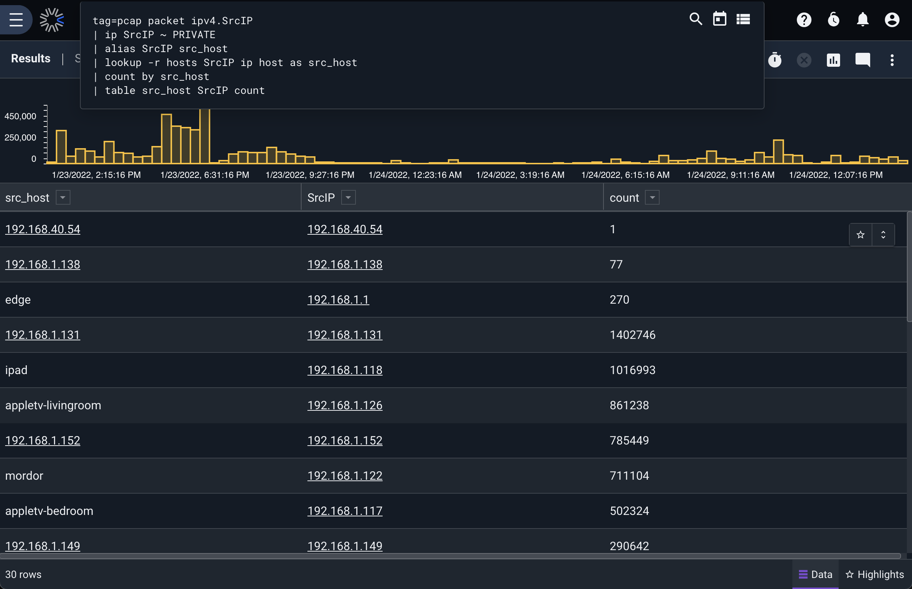

# Alias

The alias module can "clone" existing enumerated values. Modifying the new enumerated value does not change the original. This can be particularly useful when you wish to pre-populate the extracted enumerated value for the `lookup` module:

```
tag=pcap packet ipv4.SrcIP | ip SrcIP ~ PRIVATE | alias SrcIP src_host | lookup -r hosts SrcIP ip hostname as src_host | count by src_host | table src_host SrcIP count
```



The alias module takes one or more *pairs* of arguments: source, and destination. Thus, in the example above, the existing enumerated 'SrcIP' is aliased to 'src_host'. When the lookup module writes its results out into the 'src_host' enumerated value, it does not change the original 'SrcIP' value.

Multiple aliases can be made simultaneously; `alias foo bar X Y` will alias "foo" to "bar" and "X" to "Y".