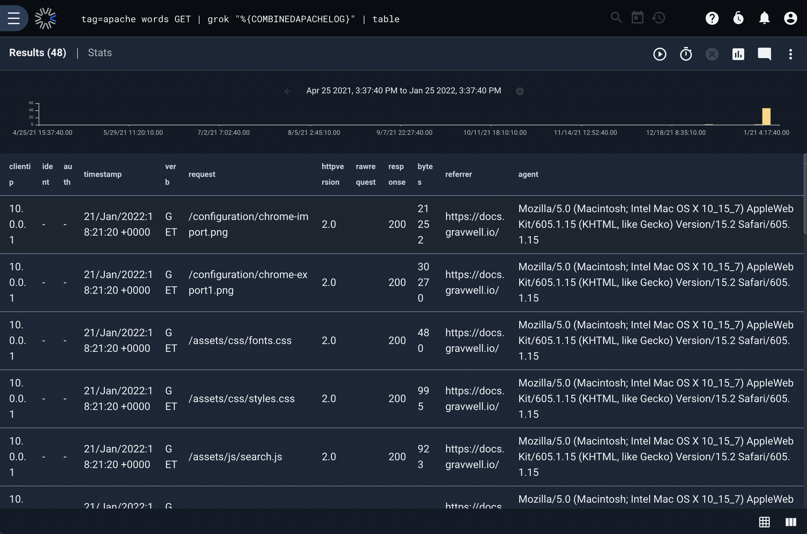
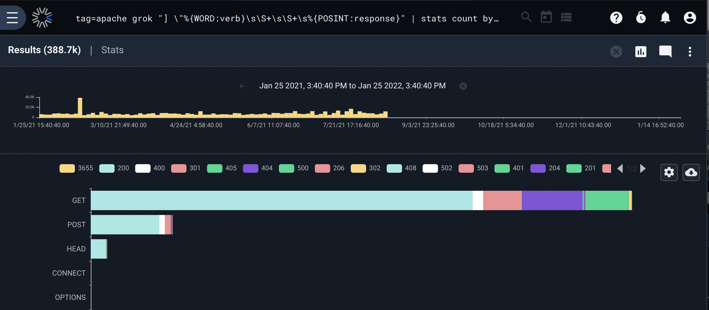

# Grok

The grok module allows you to extract data from complicated text structures without specifying the whole regular expression every time. Instead, grok assigns names to regular expressions, allowing the user to specify the name instead. Grok patterns may contain additional patterns nested within them, making it easy to build up new definitions. It pre-defines a selection of useful patterns, but can also read your own customized set of patterns from a [resource](#!resources/resources.md).

By default, grok passes through any entry which matches the pattern and drops any which does not. This behavior can be inverted with the `-v` flag.

Grok is a filtering module; after specifying the desired pattern, you may also specify a list of filters to apply to the extracted fields.

Note: Because some filters incorporate extremely strict and complex patterns, they can be relatively slow when processing large numbers of entries. Use modules such as [grep](#!search/grep/grep.md), [regex](#!search/regex/regex.md), and [words](#!search/words/words.md) to pre-filter as much as possible.

## Supported Options

* `-e <arg>`: Operate on the specified enumerated value instead of the entire record.
* `-r <resource>`: load custom grok patterns from the resource with the specified name, rather than the default `grok` resource.
* `-v`: Operate in inverse mode; entries which do *not* match the pattern will be passed, and entries which *do* match will be dropped. You cannot specify any filters when using this flag.
* `-p`: The "-p" option tells grok to allow entries through if the expression does not match at all.  The permissive flag does not change the operation of filters.

### Parse Apache Logs

The following query takes advantage of a resource to implement a complex pattern to strictly process Apache2.0 combined access logs.  The `COMBINEDAPACHELOG` pattern is part of the very large pattern set provided by DatalaiQ on [github](https://raw.githubusercontent.com/gravwell/resources/master/grok/all.grok).  Download the pattern set and upload it as a resource name `grok` to gain access to a massive suite of predefined grok patterns.

The following query finds all Apache logs for "GET" requests and parses them out into their components:

```
tag=apache words GET | grok "%{COMBINEDAPACHELOG}" | table
```



Note: This query may take some time if you have millions of entries since the COMBINEDAPACHELOG pattern is complex and very strict.

### Filtering

We can build on the previous query to return only those entries whose "clientip" field matches a particular IP and uses the GET method:

```
tag=apache words GET | grok "%{COMBINEDAPACHELOG}" clientip=="10.200.4.40" verb==GET | table clientip
```


Note: We filter for PUT and the IP using the words module to engage indexing and reduce the number of entries that are processed by the expensive `COMBINEDAPACHELOG` grok pattern.

## Performance

Grok can dramatically simplify complicated regular expressions and allow mere mortals to crack apart large log fragments.  However, a grok pattern designed to extract and validate every field in a log is going to be complex and slow.  If you don't need every field, consider using fragments and primitives.  A smaller grok pattern that only extracts a few items can be dramatically faster than a complete pattern that extracts everything.

For example, let's look at two queries that compile response code counts for each HTTP method and display them in a stackgraph, the first query uses grok with the `COMBINEDAPACHELOG` pattern allows for a very simple query:

```
tag=apache grok "%{COMBINEDAPACHELOG}" | stats count by verb response | stackgraph verb response count
```

The second query uses grok primitives to extract only the fields that are explicitly needed:

```
tag=apache grok "] \"%{WORD:verb}\s\S+\s\S+\s%{POSINT:response}" | stats count by verb response | stackgraph verb response count
```

Both queries produce identical results:



However, to process 10M Apache access logs the first query took `2m 39s`.  The second query took only `3.46s`, that is over a 45X speedup.  So while the simpler query looks great, it can be worth your time to work with primitive patterns when working on large data sets.

## Pre-defined Patterns

The Grok module provides a base set of predefined patterns that are ready for use.  These base patterns cover basic data types and are generally very strict about what they will and will not accept, for a large set of patterns designed to handle entire log sets see our the published resource on [github](https://raw.githubusercontent.com/gravwell/resources/master/grok/all.grok)

| Pattern Name | Substitution Pattern                                                                               |
| ------------ | -------------------------------------------------------------------------------------------------- |
| USERNAME | `[a-zA-Z0-9._-]+` |
| USER | `%{USERNAME}` |
| EMAILLOCALPART | `[a-zA-Z][a-zA-Z0-9_.+-=:]+` |
| HOSTNAME | `\b[0-9A-Za-z][0-9A-Za-z-]{0,62}(?:\.[0-9A-Za-z][0-9A-Za-z-]{0,62})*(\.?&#124;\b)` |
| EMAILADDRESS | `%{EMAILLOCALPART}@%{HOSTNAME}` |
| HTTPDUSER | `%{EMAILADDRESS}&#124;%{USER}` |
| INT | `[+-]?(?:[0-9]+)` |
| BASE10NUM | `[+-]?(?:(?:[0-9]+(?:\.[0-9]+)?)&#124;(?:\.[0-9]+))` |
| NUMBER | `%{BASE10NUM}` |
| BASE16NUM | `[+-]?(?:0x)?(?:[0-9A-Fa-f]+)` |
| BASE16FLOAT | `\b[+-]?(?:0x)?(?:(?:[0-9A-Fa-f]+(?:\.[0-9A-Fa-f]*)?)&#124;(?:\.[0-9A-Fa-f]+))\b` |
| POSINT | `\b[1-9][0-9]*\b` |
| NONNEGINT | `\b[0-9]+\b` |
| WORD | `\b\w+\b` |
| NOTSPACE | `\S+` |
| SPACE | `\s*` |
| DATA | `.*?` |
| GREEDYDATA | `.*` |
| QUOTEDSTRING | ``("(\\.&#124;[^\\"]+)+")&#124;""&#124;('(\\.&#124;[^\\']+)+')&#124;''&#124;(`(\\.|[^\\`]+)+`)|`` |
| UUID | `[A-Fa-f0-9]{8}-(?:[A-Fa-f0-9]{4}-){3}[A-Fa-f0-9]{12}` |
| UNIXPATH | `(/([\w_%!$@:.,~-]+&#124;\\.)*)+` |
| TTY | `/dev/(pts&#124;tty([pq])?)(\w+)?/?(?:[0-9]+)` |
| WINPATH | `(?:[A-Za-z]+:&#124;\\)(?:\\[^\\?*]*)+` |
| PATH | `%{UNIXPATH}&#124;%{WINPATH}` |
| URIPROTO | `[A-Za-z]+(\+[A-Za-z+]+)?` |
| URIHOST | `%{IPORHOST}(?::%{POSINT:port})?` |
| URIPATH | `(?:/[A-Za-z0-9$.+!*'(){},~:;=@#%_\-]*)+` |
| URIPARAM | `\?[A-Za-z0-9$.+!*'&#124;(){},~@#%&/=:;_?\-\[\]<>]*` |
| URIPATHPARAM | `%{URIPATH}(?:%{URIPARAM})?` |
| URI | `%{URIPROTO}://(?:%{USER}(?::[^@]*)?@)?(?:%{URIHOST})?(?:%{URIPATHPARAM})?` |
| MONTH | `\bJan(?:uary&#124;uar)?&#124;Feb(?:ruary&#124;ruar)?&#124;M(?:a&#124;ä)?r(?:ch&#124;z)?&#124;Apr(?:il)?&#124;Ma(?:y&#124;i)?&#124;Jun(?:e&#124;i)?&#124;Jul(?:y)?&#124;Aug(?:ust)?&#124;Sep(?:tember)?&#124;O(?:c&#124;k)?t(?:ober)?&#124;Nov(?:ember)?&#124;De(?:c&#124;z)(?:ember)?\b` |
| MONTHNUM | `0?[1-9]&#124;1[0-2]` |
| MONTHNUM2 | `0[1-9]&#124;1[0-2]` |
| MONTHDAY | `(?:0[1-9])&#124;(?:[12][0-9])&#124;(?:3[01])&#124;[1-9]` |
| DAY | `Mon(?:day)?&#124;Tue(?:sday)?&#124;Wed(?:nesday)?&#124;Thu(?:rsday)?&#124;Fri(?:day)?&#124;Sat(?:urday)?&#124;Sun(?:day)?` |
| YEAR | `(?:\d\d){1,2}` |
| HOUR | `2[0123]&#124;[01]?[0-9]` |
| MINUTE | `[0-5][0-9]` |
| SECOND | `(?:[0-5]?[0-9]&#124;60)(?:[:.,][0-9]+)?` |
| TIME | `%{HOUR}:%{MINUTE}:%{SECOND}` |
| DATE_US | `%{MONTHNUM}[/-]%{MONTHDAY}[/-]%{YEAR}` |
| DATE_EU | `%{MONTHDAY}[./-]%{MONTHNUM}[./-]%{YEAR}` |
| DATE_X | `%{YEAR}/%{MONTHNUM2}/%{MONTHDAY}` |
| ISO8601_TIMEZONE | `Z&#124;[+-]%{HOUR}(?::?%{MINUTE})` |
| ISO8601_SECOND | `%{SECOND}&#124;60` |
| TIMESTAMP_ISO8601 | `%{YEAR}-%{MONTHNUM}-%{MONTHDAY}[T ]%{HOUR}:?%{MINUTE}(?::?%{SECOND})?%{ISO8601_TIMEZONE}?` |
| DATE | `%{DATE_US}&#124;%{DATE_EU}&#124;%{DATE_X}` |
| DATESTAMP | `%{DATE}[- ]%{TIME}` |
| TZ | `[A-Z]{3}` |
| NUMTZ | `[+-]\d{4}` |
| DATESTAMP_RFC822 | `%{DAY} %{MONTH} %{MONTHDAY} %{YEAR} %{TIME} %{TZ}` |
| DATESTAMP_RFC2822 | `%{DAY}, %{MONTHDAY} %{MONTH} %{YEAR} %{TIME} %{ISO8601_TIMEZONE}` |
| DATESTAMP_OTHER | `%{DAY} %{MONTH} %{MONTHDAY} %{TIME} %{TZ} %{YEAR}` |
| DATESTAMP_EVENTLOG | `%{YEAR}%{MONTHNUM2}%{MONTHDAY}%{HOUR}%{MINUTE}%{SECOND}` |
| HTTPDERROR_DATE | `%{DAY} %{MONTH} %{MONTHDAY} %{TIME} %{YEAR}` |
| ANSIC | `%{DAY} %{MONTH} [_123]\d %{TIME} %{YEAR}"` |
| UNIXDATE | `%{DAY} %{MONTH} [_123]\d %{TIME} %{TZ} %{YEAR}` |
| RUBYDATE | `%{DAY} %{MONTH} [0-3]\d %{TIME} %{NUMTZ} %{YEAR}` |
| RFC822Z | `[0-3]\d %{MONTH} %{YEAR} %{TIME} %{NUMTZ}` |
| RFC850 | `%{DAY}, [0-3]\d-%{MONTH}-%{YEAR} %{TIME} %{TZ}` |
| RFC1123 | `%{DAY}, [0-3]\d %{MONTH} %{YEAR} %{TIME} %{TZ}` |
| RFC1123Z | `%{DAY}, [0-3]\d %{MONTH} %{YEAR} %{TIME} %{NUMTZ}` |
| RFC3339 | `%{YEAR}-[01]\d-[0-3]\dT%{TIME}%{ISO8601_TIMEZONE}` |
| RFC3339NANO | `%{YEAR}-[01]\d-[0-3]\dT%{TIME}\.\d{9}%{ISO8601_TIMEZONE}` |
| KITCHEN | `\d{1,2}:\d{2}(AM&#124;PM&#124;am&#124;pm)` |
| SYSLOGTIMESTAMP | `%{MONTH} +%{MONTHDAY} %{TIME}` |
| LOGLEVEL | `[Aa]lert&#124;ALERT&#124;[Tt]race&#124;TRACE&#124;[Dd]ebug&#124;DEBUG&#124;[Nn]otice&#124;NOTICE&#124;[Ii]nfo&#124;INFO&#124;[Ww]arn?(?:ing)?&#124;WARN?(?:ING)?&#124;[Ee]rr?(?:or)?&#124;ERR?(?:OR)?&#124;[Cc]rit?(?:ical)?&#124;CRIT?(?:ICAL)?&#124;[Ff]atal&#124;FATAL&#124;[Ss]evere&#124;SEVERE&#124;EMERG(?:ENCY)?&#124;[Ee]merg(?:ency)?` |
| QS | `%{QUOTEDSTRING}` |
| NQS | `[^"]*` |
| PROG | `[\x21-\x5a\x5c\x5e-\x7e]+` |
| CISCOMAC | `(?:[A-Fa-f0-9]{4}\.){2}[A-Fa-f0-9]{4}` |
| WINDOWSMAC | `(?:[A-Fa-f0-9]{2}-){5}[A-Fa-f0-9]{2}` |
| COMMONMAC | `(?:[A-Fa-f0-9]{2}:){5}[A-Fa-f0-9]{2}` |
| MAC | `%{CISCOMAC}&#124;%{WINDOWSMAC}&#124;%{COMMONMAC}` |
| IPV4 | `(?:(?:25[0-5]&#124;2[0-4][0-9]&#124;[01]?[0-9][0-9]?)\.){3}(?:25[0-5]&#124;2[0-4][0-9]&#124;[01]?[0-9][0-9]?)` |
| IPV6 | `((([0-9A-Fa-f]{1,4}:){7}([0-9A-Fa-f]{1,4}&#124;:))&#124;(([0-9A-Fa-f]{1,4}:){6}(:[0-9A-Fa-f]{1,4}&#124;((25[0-5]&#124;2[0-4]\d&#124;1\d\d&#124;[1-9]?\d)(\.(25[0-5]&#124;2[0-4]\d&#124;1\d\d&#124;[1-9]?\d)){3})&#124;:))&#124;(([0-9A-Fa-f]{1,4}:){5}(((:[0-9A-Fa-f]{1,4}){1,2})&#124;:((25[0-5]&#124;2[0-4]\d&#124;1\d\d&#124;[1-9]?\d)(\.(25[0-5]&#124;2[0-4]\d&#124;1\d\d&#124;[1-9]?\d)){3})&#124;:))&#124;(([0-9A-Fa-f]{1,4}:){4}(((:[0-9A-Fa-f]{1,4}){1,3})&#124;((:[0-9A-Fa-f]{1,4})?:((25[0-5]&#124;2[0-4]\d&#124;1\d\d&#124;[1-9]?\d)(\.(25[0-5]&#124;2[0-4]\d&#124;1\d\d&#124;[1-9]?\d)){3}))&#124;:))&#124;(([0-9A-Fa-f]{1,4}:){3}(((:[0-9A-Fa-f]{1,4}){1,4})&#124;((:[0-9A-Fa-f]{1,4}){0,2}:((25[0-5]&#124;2[0-4]\d&#124;1\d\d&#124;[1-9]?\d)(\.(25[0-5]&#124;2[0-4]\d&#124;1\d\d&#124;[1-9]?\d)){3}))&#124;:))&#124;(([0-9A-Fa-f]{1,4}:){2}(((:[0-9A-Fa-f]{1,4}){1,5})&#124;((:[0-9A-Fa-f]{1,4}){0,3}:((25[0-5]&#124;2[0-4]\d&#124;1\d\d&#124;[1-9]?\d)(\.(25[0-5]&#124;2[0-4]\d&#124;1\d\d&#124;[1-9]?\d)){3}))&#124;:))&#124;(([0-9A-Fa-f]{1,4}:){1}(((:[0-9A-Fa-f]{1,4}){1,6})&#124;((:[0-9A-Fa-f]{1,4}){0,4}:((25[0-5]&#124;2[0-4]\d&#124;1\d\d&#124;[1-9]?\d)(\.(25[0-5]&#124;2[0-4]\d&#124;1\d\d&#124;[1-9]?\d)){3}))&#124;:))&#124;(:(((:[0-9A-Fa-f]{1,4}){1,7})&#124;((:[0-9A-Fa-f]{1,4}){0,5}:((25[0-5]&#124;2[0-4]\d&#124;1\d\d&#124;[1-9]?\d)(\.(25[0-5]&#124;2[0-4]\d&#124;1\d\d&#124;[1-9]?\d)){3}))&#124;:)))(%.+)?` |
| IP | `%{IPV6}&#124;%{IPV4}` |
| IPORHOST | `%{IP}&#124;%{HOSTNAME}` |
| HOSTPORT | `%{IPORHOST}:%{POSINT}` |
| HTTPDATE | `%{MONTHDAY}/%{MONTH}/%{YEAR}:%{TIME} %{INT}` |
