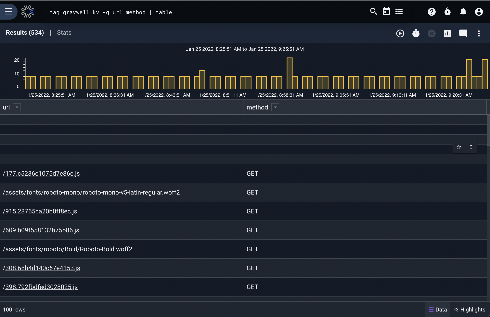
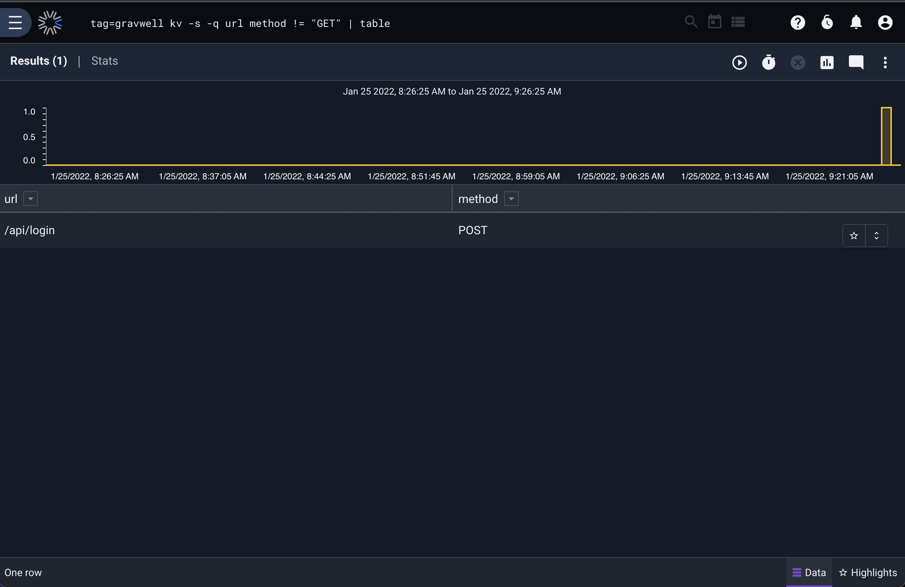

# KV

The kv module is used to extract and filter key-value formatted data from search entries into enumerated values for further analysis. Key-value data consists of one or more key-value pairs, such as `a = 1` or `Name: Fred`.

## Key-Value Terminology

The kv module uses a few specific terms to describe key-value data formats. They are:

* Separator: The character(s) which separate the key from the value, such as '='.
* Delimiters: The character(s) which separate key-value pairs from each other. May also exist between the key and the separator or the separator and the delimiter.

For example, the following entry contains 4 key-value pairs, using '=' as the separator and spaces as the delimiters:

```
x=1 y=2 z=3 foo=bar
```


This entry contains the same key-value pairs but uses ':' as the separator and '|' as the delimiter:

```
x:1|y:2|z:3|foo:bar
```

## Supported Options

* `-e <arg>`: The "-e" option operates on an enumerated value instead of on the entire record.
* `-sep <separator>`: The "-sep" flag allows the user to specify the separator. This can be one or more characters, for example `-sep EQUALS`.
* `-d <delimiters>`: The "-d" flag specifies the delimiters to use. You can specify multiple delimiters characters; for example, to use double-quote, tab, and space as delimiters, set `-d "\" \t"`.
* `-s`: The "-s" option puts the module into strict mode. In strict mode, an entry will be dropped unless *all* specified extractions succeed.
* `-q`: The "-q" option enables quoted values. This allows values to contain the delimiter characters, e.g. `key="this is the value"`
* `-noclean`: The "-noclean" option will disable trimming left whitespace on extracted tokens, even if the whitespace is contained in the delimiters field. For example `key=   value` would be extracted with the leading 3 spaces intact.

```
x= 1 y = 2 z=3 foo    =  bar
x=1 y=2 z=3 foo=bar
```

## Key renaming

Extracted keys can be renamed by appending the directive `as <name>` immediately after a key.  For example, to extract the key "foo" into an enumerated value with the name "bar" the extraction directive would be `foo as bar`.  If no rename directive is provided the extracted values are given the name that matches the key.

## Filtering

The kv module can filter based on string equality. If a filter is enabled that specifies equality ("equal", "not equal", "contains", "not contains") any entry that fails the filter specification on one or more extracted values will be dropped entirely.  If a key is specified as not equal "!=" and the key does not exist, the field is not extracted but the entry won't be dropped entirely (unless `-s` is set).

| Operator | Name | Description |
|----------|------|-------------|
| == | Equal | Field must be equal
| != | Not equal | Field must not be equal
| ~ | Subset | Field contains the value
| !~ | Not Subset | Field does NOT contain the value

## Examples

Given syslog entries similar to:

```
<14>1 2022-01-25T11:30:00.007605-07:00 15ea885e7f50 webserver 20000069 webserver/bgSearch.go:722 [gw@1 searchid="43289156989" uid="1" query="tag=gravwell syslog Appname==webserver method==POST url==\"/api/login\" status elapsed | sort by elapsed desc | table status elapsed TIMESTAMP" start="2021-07-25 10:56:25 -0600 MDT" end="2022-01-25 10:56:25 -0700 MST" elapsed="14.220625144s"] Search finished
```

The following query will extract the url and method fields and show them in a table:

```
tag=syslog kv -q url method | table
```


This query will drop all entries whose method is not "GET":

```
tag=syslog kv -q url method != "GET" | table
```



### Changing the separator

The separator can be set to any string of characters; for example, key-value pairs might look like this:

```
x EQUALS 1 y EQUALS 2
```

You could extract the value of 'y' using the following:

```
kv -sep EQUALS y
```
