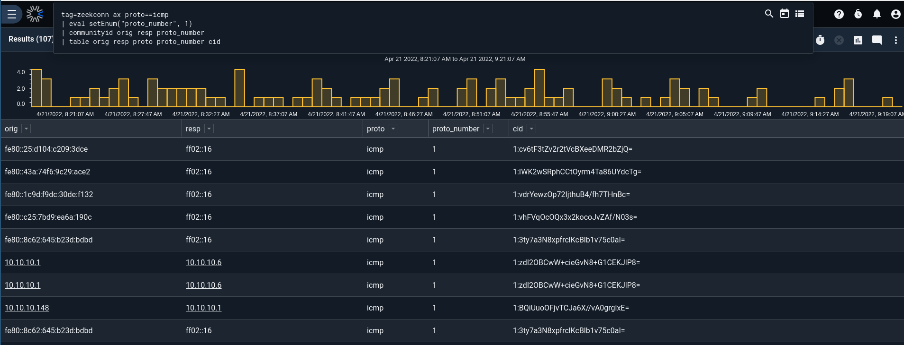

## Zeek Community ID

The `communityid` module is designed to implement the Zeek Community ID spec, a cross-platform identifier that can uniquely identify a given network connection between two systems.  The `communityid` module can therefore be used to link network flows across disparate data types.  Additional information about the Zeek Community ID specification can be found on the [Zeek webpage](https://zeek.org/2019/07/31/an-update-on-community-id/) and the [Zeek Github Repository](https://github.com/corelight/zeek-community-id).


The module takes two IP:port pairs plus a protocol identifier and computes a hash that represents the network flow.  The ports are optional and ignored for non-TCP and non-UDP protocols.  If ports are not provided and the community ID algorithm expects them for the calculation, zero values are inserted.


```
tag=netflow netflow Src SrcPort Dst DstPort Protocol
| communityid Src Dst SrcPort DstPort Protocol
| table
```

The ordering of source and destination ip port pairs is computed inside the algorithm, so you do not need to resolve the source or destination beforehand.  However, it is **critical** that the order of ports match the source and destination IP addresses.

Community id parameters are orderd as `<IP A> <IP B> <Port A> <Port B> <Protocol Number>` where the two port specifications are optional.

It is valid to exclude both port numbers: `<IP A> <IP B> <Protocol Number>`. Note that including one port but not the other is invalid.

Note: The `communityid` module requires the protocol *number*, it will not resolve a protocol name.

### Examples

#### Zeek Conn Logs

In this example we show how to get a community ID value from traditional Zeek conn logs.  These logs include the protocol by name rather than number, which means we need to use the `network_services` resource from the Gravwell Network Enrichment kit to resolve the name back to a number.  In this example we are also using the autoextractors provided in the DatalaiQ Zeek Kit to process the TSV Zeek logs.

```
tag=zeekconn ax
| lookup -r network_services proto proto_name proto_number
| communityid orig resp orig_port resp_port proto_number
| table orig resp orig_port resp_port proto proto_number cid
```


#### IPFIX

In this example we generate a community ID value from IPFIX data. This example uses the native IP, port, and protocol values from within the IPFIX datatypes.  No lookups are needed.

```
tag=ipfix ipfix src dst srcPort dstPort protocolIdentifier
| communityid  src dst srcPort dstPort protocolIdentifier
| table
```


#### ICMP Example

In this example we generate a community ID value from a data source that may not have ports. We are using Zeek Conn logs and ICMP traffic for this example, but if you had text records of ICMP traffic they would work too. Note that rather than using a lookup, we simply set `proto_number` manually


```
tag=zeekconn ax proto==icmp
| enrich proto_number 1
| communityid orig resp proto_number
| table orig resp proto proto_number cid
```


