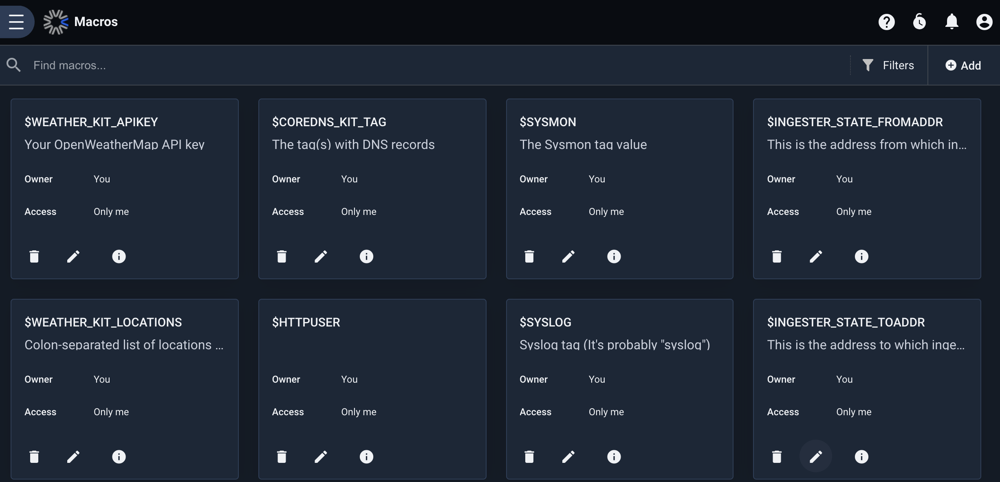
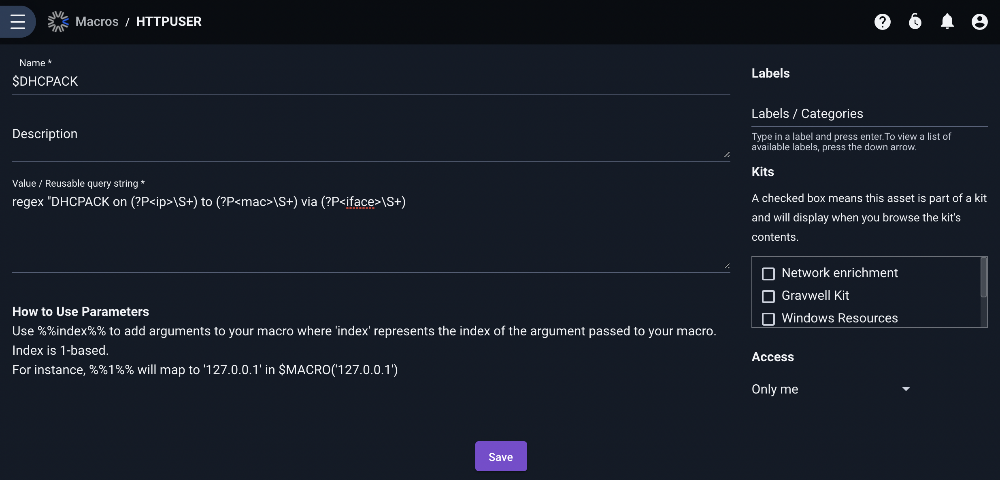

# Search Macros

Search macros are a powerful feature that can help you use DatalaiQ more effectively. Macros can turn long, repetitive search queries into easily-remembered shortcuts.

## Macro Basics

Macros are essentially string replacement rules which are applied to the search query string. The macro maps a short, name (like $MYMACRO) to a longer string. When DatalaiQ parses the search query, it looks for macro names (defined as a dollar sign followed by at least one capital letter or number) and does the replacement before launching the search. The GUI will show the expanded version of the query when you use a macro.

For example, you may define a macro named `$DHCPACK` which expands to `regex "DHCPACK on (?P<ip>\S+) to (?P<mac>\S+) via (?P<iface>\S+)`. You can then use that macro in place of the regex invocation, e.g. `tag=syslog $DHCPACK | unique ip mac | table ip mac`.

A macro can contain any part of a regular DatalaiQ query: the tag specification, search modules, or render modules. A macro can even contain an entire query, although you may find the search library a more useful tool for storing entire queries.

### Macro arguments

Macros can be defined with arguments. To define a macro that takes arguments, put replacement directives in the format `%%1%%`, `%%2%%`, etc. in the query string. Those directives will be replaced by the arguments given at run-time. For example, we might define a macro named `HTTPUSER` which expands to `tag=bro-http ax user_agent~"%%1%%"`. Later, we can pass arguments to the macro as though it were a C or Python function:

### Nested macros

A macro can contain another macro. We can define a macro `$FOO` which expands to `tag=foo json timestamp $BAR`; when you use the macro, DatalaiQ will see that the expansion contains another macro and will in turn expand the $BAR macro as well.

DatalaiQ will continue expanding macros for several iterations, although it will catch infinite recursion if a macro loop exists.

## Defining a Macro

The macro management page is found in the main DatalaiQ menu:

To add a new macro, select the Add button in the upper right. A window will pop up prompting for the macro name and the query string; the screenshot below shows a definition of the DHCPACK macro described previously:

