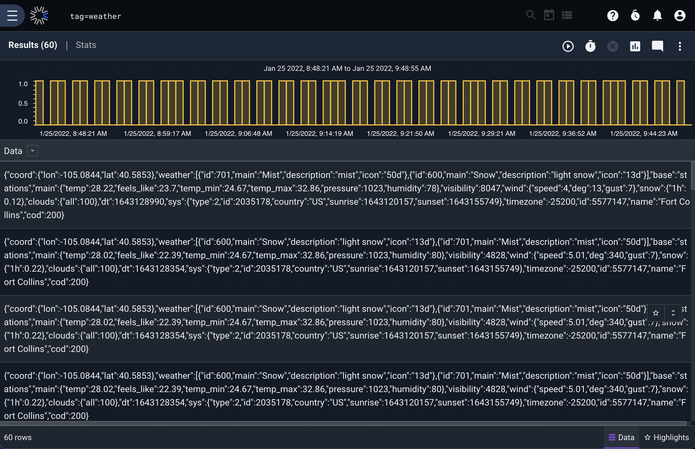
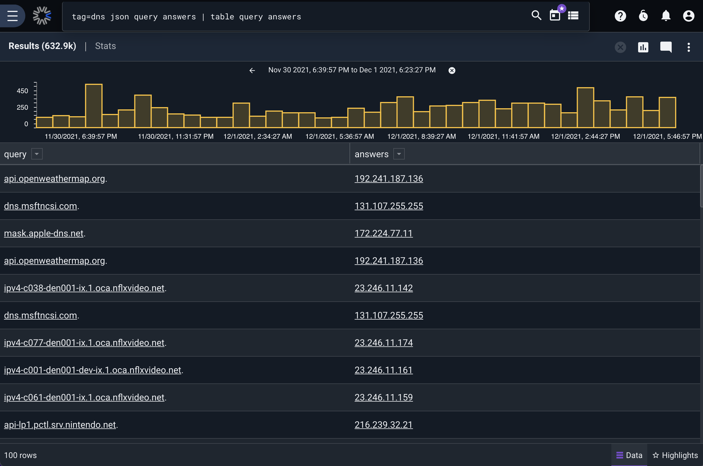
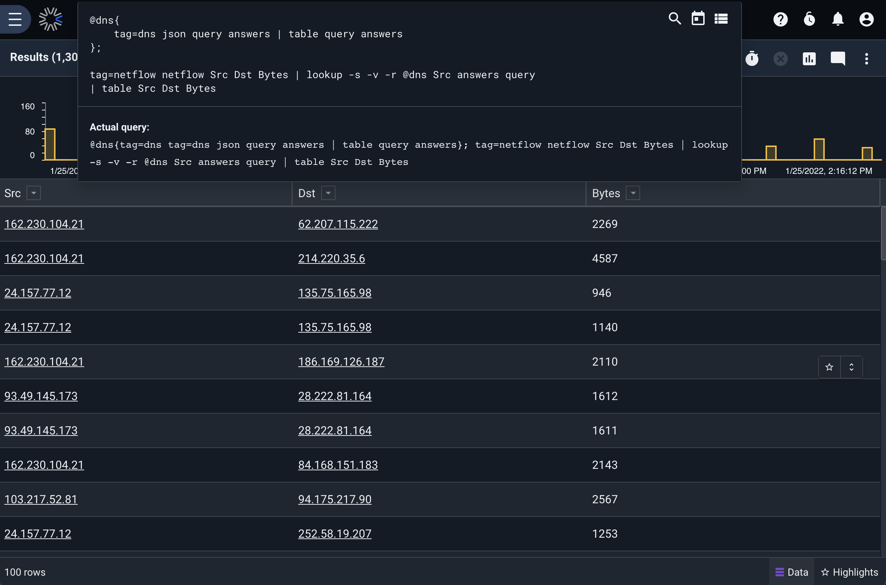

# Searching with DatalaiQ

DatalaiQ is a structure-on-read data lake and the search pipeline is the core of that functionality. This is where the power and flexibility of the platform can be seen: we don't need to know much about the data at collection time. Instead, we can ingest the raw data and assemble a search processing pipeline to turn that raw data into actionable results! This all but eliminates normalizing or massaging data to try and fit specific molds, a common issue with SIEMs. Further, it lets us perform analysis retroactively against older data when new information, techniques, or search modules become available.

The search pipeline is the core of DatalaiQ's functionality and operates in a similar fashion to the Linux/Unix command line. The DatalaiQ search query syntax assembles a processing pipeline to search and transform raw data into results. The pipeline modules often consist of at least one extraction module, one or more filtering or processing modules, and a rendering module. For example, the following query fetches data tagged "weather", uses the json module to extract a temperature and location name, then uses the eval module to filter out any entries with temperatures below 50 degrees, then finally uses the table renderer to display the contents of the name and temp fields:

```
tag=weather json main.temp name | eval temp > 20 | table name temp
```


The user interface used to run queries [is documented here](#!gui/queries/queries.md).

<video controls>
	<source src="https://www.gravwell.io/hubfs/videos/Query%20Basics.mp4" type="video/mp4">
	Your browser does not support the video tag
</video>

## Entries

Entries are the basic unit of data in DatalaiQ. Entries are generated by *ingesters* and sent to *indexers*, where they are stored until queried. Every entry contains 4 fields: DATA, TIMESTAMP, SRC, and TAG.


The TAG field categorizes a particular entry: Netflow records might be tagged "netflow", syslog records from a webserver could be tagged "syslog-www", etc. The SRC field is an IP address indicating where the entry originated. The TIMESTAMP field indicates when the entry was created. The DATA field contains the actual body of the entry, be it a raw TCP/IP packet, a syslog record, a Windows event log in XML format. There is no restriction on what goes in the DATA field--datalaiq will accept and store any binary data.

In the example query shown above, we are dealing with entries tagged "weather" whose DATA fields contain JSON that looks like this:

```
{"coord":{"lon":-116.8,"lat":47.69},"weather":[{"id":801,"main":"Clouds","description":"few clouds","icon":"02d"}],"base":"stations","main":{"temp":40.91,"feels_like":34.56,"temp_min":39.2,"temp_max":42.01,"pressure":1032,"humidity":80},"visibility":10000,"wind":{"speed":5.82,"deg":200},"clouds":{"all":20},"dt":1605896400,"sys":{"type":1,"id":3672,"country":"US","sunrise":1605884460,"sunset":1605917119},"timezone":-28800,"id":5589173,"name":"Coeur d'Alene","cod":200}
```
```
{"coord":{"lon":-106.65,"lat":35.08},"weather":[{"id":800,"main":"Clear","description":"clear sky","icon":"01d"}],"base":"stations","main":{"temp":62.94,"feels_like":56.34,"temp_min":61,"temp_max":66,"pressure":1029,"humidity":27},"visibility":10000,"wind":{"speed":4.52,"deg":224},"clouds":{"all":1},"dt":1605896230,"sys":{"type":1,"id":3232,"country":"US","sunrise":1605880012,"sunset":1605916694},"timezone":-25200,"id":5454711,"name":"Albuquerque","cod":200}
```

The query takes this raw JSON and applies structure to it for our analysis.

## Components of a Query

The example query above can be broken into several individual portions, which are described below.

### Tag Specification

The first part of a DatalaiQ query is the tag specification. The user must specify one or more tags from which the indexers should pull data to put into the start of the pipeline. The following tells DatalaiQ to take data tagged "reddit":

```
tag=reddit
```

You can also specify multiple tags:

```
tag=reddit,hackernews
```

Or you can use wildcards:

```
tag=syslog-http-*,syslog-firewall-*
```

These are all valid queries; if you run a query that is just a tag specification, DatalaiQ will fetch the entries and show you the unprocessed contents:



### Extraction Modules

Extraction modules are used to pull out fields/values/properties from the raw underlying data. Given entries containing the weather data shown earlier, we can use the following query to pull out the location name and temperature, then show only the entries with a temperature over 50 degrees:

```
tag=weather json main.temp name | eval temp > 50 | table name temp
```

In the example above, the `JSON` module is extracting the values from the raw JSON text and providing them as "Enumerated Values" for any modules further down the pipeline. In other words, this module parses the JSON to extract particular components the user needs. We extract the fields "name" and "temp", the latter being found *within* the "main" field.

The full documentation for these modules can be found at [Extraction Modules](extractionmodules.md)

#### Filtering

DatalaiQ extraction modules will typically allow *extracted* items to be *filtered* at extraction time. Filtering lets you drop or pass entries based on whether or not they match particular criteria; see [this page](filtering.md) for full documentation.


### Processing Modules

Processing modules are used to analyze data entries, filtering out undesired data, performing statistical analyses,. A search pipeline may include many processing modules, one after another, each operating on the results of the previous module.

In the example shown in the previous section, `eval` is a processing module performing some filtering. Note that many processing modules can be made to operate on a subset of the overall query tags by putting an *additional* tag specification before the module invocation -- something we call Data Fusion. This can be very useful if you need to perform some initial extractions differently:

```
tag=reddit,hackernews tag=reddit json Body | tag=hackernews json body as Body | eval len(Body) < 20 | table Body
```

[Click here for complete documentation of processing modules](processingmodules.md)


### Render Modules

Render modules take the results generated by the search modules and present them to the user graphically. A search pipeline will only include one render module, at the very end of the pipeline.

```
tag=weather json main.temp name | eval temp > 50 | table name temp
```

In the example above, "table" is the render module; it has been told to display the contents of the "name" and "temp" Enumerated Values in their own columns.

[Click here for complete documentation of render modules](rendermodules.md)


## Enumerated Values

Enumerated values are special data elements which are created and used within the search pipeline. In the pipeline below, several enumerated values are created.

```
tag=reddit json Body | langfind -e Body | count by lang | sort by count desc | table lang count
```

First, the json module parses the JSON in the raw entries and pulls out the "Body" element, storing it in an enumerated value named `Body`. Then the langfind module accesses the `Body` enumerated values and attempts to analyze the language used; it puts the result in a new enumerated value called `lang`. Next, the count module reads the `lang` enumerated values and counts how many times each value appears, storing the results in enumerated values named `count`. The rest of the pipeline sorts the results based on the counts and creates a table from the `lang` and `count` enumerated values.

You can think of enumerated values as additional fields which are attached to an entry over the course of a query; if we use the netflow module to extract Src and Dst values from the raw DATA field, we add Src and Dst fields to the entry:

```
tag=netflow netflow Src Dst
```


Further examples throughout the documentation should help clarify the use of enumerated values.

## Quoting and tokenizing

When specifying arguments to DatalaiQ modules, be mindful of special characters. Most modules treat spaces, tabs, newlines, and the following characters as separators: !#$%&'()*+,-./:;<=>?@

When specifying an argument to a module which contains one of these characters, wrap the argument in double-quotes:

```
json "search-id"
```

```
grep "dank memes"
```

You can escape double quote characters if you need to use them, for instance to identify mis-used dialog tags in text you could search for the sequence `",`:

```
grep "\","
```

## Macros

Macros can help turn long, complex queries into easy-to-remember shortcuts. See [the full macro documentation](#!search/macros.md) for more information.

## Compound Queries

You can combine multiple queries together as a single "compound" query in order to leverage multiple data sources, fuse data into another query, and simplify complex queries. DatalaiQ's compound query syntax is a simple sequence of in-order queries, with additional notation to create temporary resources that can be referenced in queries later in the sequence. 

A compound query consists of a main query (the last query in a sequence), and one or more inner queries. The main query is written just like a normal query, while inner queries are always wrapped in the notation `@<identifier>{<query>}`. Queries are separated by `;`. 

Inner queries generate named resources in the form of `@<identifier>`. These resources can be used as a regular resources with any module that supports table-based resources, listed below:

| Module | Notes |
|--------|-------|
| [dump](#!search/dump/dump.md) | | 
| [enrich](#!search/enrich/enrich.md) | | 
| [ipexist](#!search/ipexist/ipexist.md) | Inner queries must use the table module with the `-format ipexist` flag |
| [iplookup](#!search/iplookup/iplookup.md) | Inner queries must use the table module with the `-format csv` flag |
| [lookup](#!search/lookup/lookup.md) | |
| [anko](#!search/anko/anko.md) | Anko scripts can read from named resources |

Named resources are scoped to the compound query they exist in, and are ephemeral - they are only accessible to other queries in the compound query, and are deleted as soon as the query is completed. 

For example, say we have both DNS query and IP-level connection data under the tags "dns" and "conns", and we want to filter connection data down to only connections that didn't first have a corresponding DNS query. We can use compound queries to enrich our first query with DNS data and filter.

Let's start with the inner query:

```
tag=dns json query answers | table query answers
```

This produces a table:



In the inner query, we simply create a table of all queries and answers in our DNS data. Since this is an inner query, we need to give it a name so later queries can reference its output, and wrap the query in braces. We'll call this inner query "dns":

```
@dns{tag=dns json query answers | table query answers}
```

In the main query, we use our connection data, and use the `lookup` module to read from our inner query "@dns":

```
tag=conns json SrcIP DstIP SrcIPBytes DstIPBytes | lookup -s -v -r @dns SrcIP answers query 
| table SrcIP DstIP SrcIPBytes DstIPBytes 
```

This query uses the `lookup` module drop (via the `-s` and `-v` flags) any entry in our conns data that has a SrcIP that matches a DNS answer. From there we simply create a table of our data. 

We wrap this into a compound query simply by joining the queries together and separating them with a `;`:

```
@dns{
	tag=dns json query answers | table query answers
};

tag=conns json SrcIP DstIP SrcIPBytes DstIPBytes | lookup -s -v -r @dns SrcIP answers query 
| table SrcIP DstIP SrcIPBytes DstIPBytes 
```

This gives us a table of just connections that didn't have a corresponding DNS query:



## Comments

Queries support C-Style comments anywhere in the query text. Comments are saved in the search history, and are useful for debugging queries and adding inline notes. For example:

```
tag=foo json foo.bar /* a c-style comment that has no impact on the search */ baz | table
```

